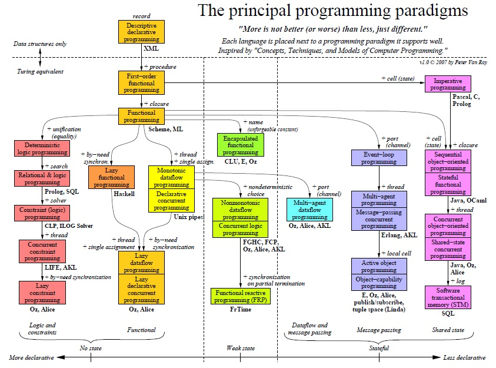
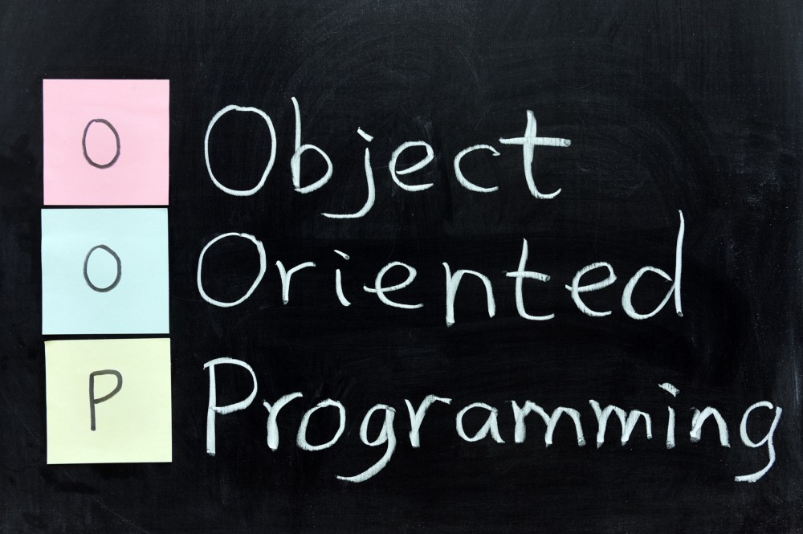
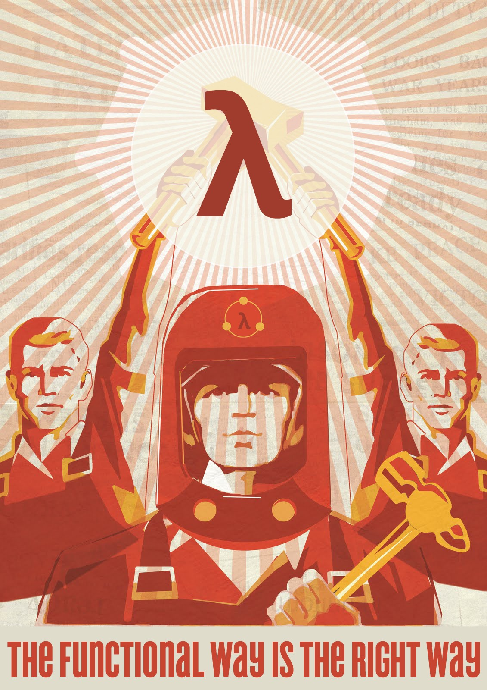
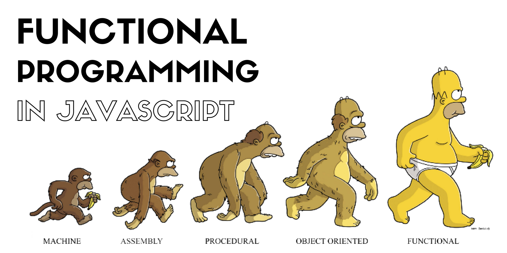
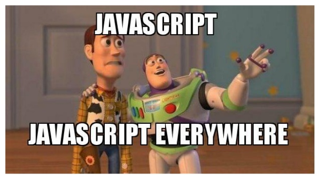
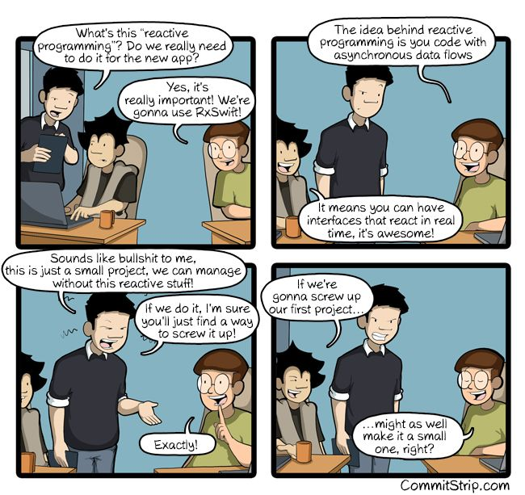
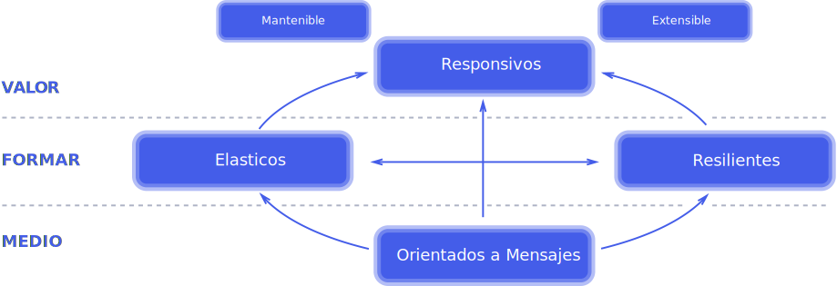
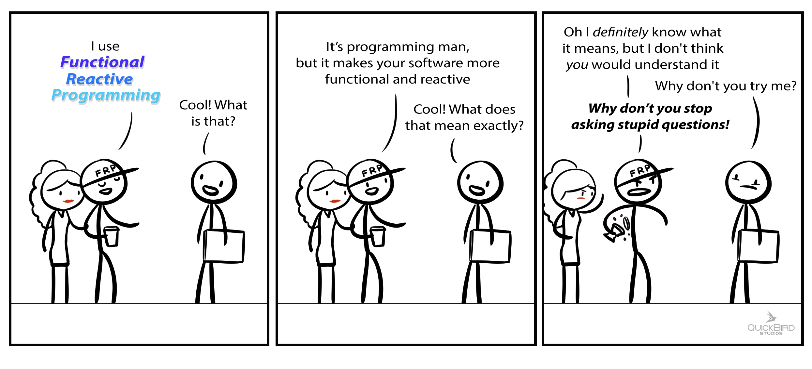
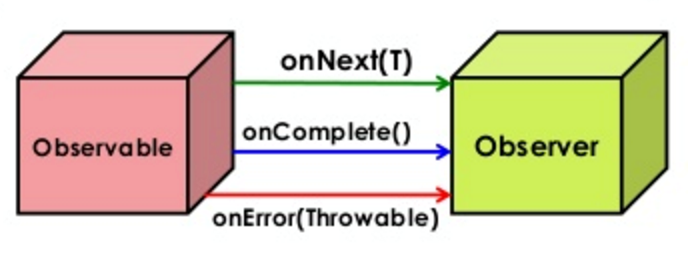
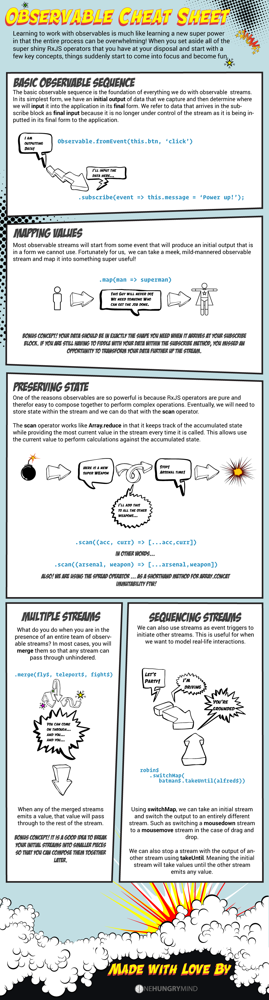

# [Curso de JavaScript Avanzado para desarrolladores Front-end](https://fictizia.com/formacion/curso-javascript-avanzado)
### POO con JS, ECMA6, Patrones de diseño, AJAX avanzado, HTML5 avanzado, APIs externas.


## Clase 6

### Paradigmas de Programación



> Un paradigma de programación es una propuesta tecnológica adoptada por una comunidad de programadores y desarrolladores cuyo núcleo central es incuestionable en cuanto que únicamente trata de resolver uno o varios problemas claramente delimitados; la resolución de estos problemas debe suponer consecuentemente un avance significativo en al menos un parámetro que afecte a la ingeniería de software.
> Un paradigma de programación representa un enfoque particular o filosofía para diseñar soluciones. Los paradigmas difieren unos de otros, en los conceptos y la forma de abstraer los elementos involucrados en un problema, así como en los pasos que integran su solución del problema, en otras palabras, el cómputo.
> Tiene una estrecha relación con la formalización de determinados lenguajes en su momento de definición. Es un estilo de programación empleado.
> Un paradigma de programación está delimitado en el tiempo en cuanto a aceptación y uso, porque nuevos paradigmas aportan nuevas o mejores soluciones que la sustituyen parcial o totalmente.
> [Wikipedia](https://es.wikipedia.org/wiki/Paradigma_de_programaci%C3%B3n)

**Paradigmas principales**
- [Programación imperativa o por procedimientos](https://es.wikipedia.org/wiki/Programaci%C3%B3n_imperativa) 
	- Extendida en C, BASIC o Pascal.
	- La programación imperativa es la más usada y la más antigua
	- Se basa en dar instrucciones al ordenador de como hacer las cosas en forma de algoritmos.
- [Programación orientada a objetos (POO/OOP)](https://es.wikipedia.org/wiki/Programaci%C3%B3n_orientada_a_objetos)
	- Extendida en C++, C#, Java, Python... 
	- Está basada en el imperativo, pero encapsula elementos denominados objetos que incluyen tanto variables como funciones
- [Programación dirigida por eventos](https://es.wikipedia.org/wiki/Programaci%C3%B3n_dirigida_por_eventos)
	- Tanto la estructura como la ejecución de los programas van determinados por los sucesos que ocurran en el sistema, definidos por el usuario o que ellos mismos provoquen.
- [Programación funcional](https://es.wikipedia.org/wiki/Programaci%C3%B3n_funcional)
	- Basada en la definición los predicados
	- Es de corte más matemático
	- Extendida en Python, Haskell, etc...
- [Programación reactiva](https://es.wikipedia.org/w/index.php?title=Programaci%C3%B3n_reactiva&action=edit&redlink=1)
	- Este paradigma se basa en la declaración de una serie de objetos emisores de eventos asíncronos y otra serie de objetos que se "suscriben" a los primeros (es decir, quedan a la escucha de la emisión de eventos de estos) y *reaccionan* a los valores que reciben. 
	- Es muy común usar la librería Rx de Microsoft (Reactive Extensions)
- [Programación multiparadigma](https://es.wikipedia.org/wiki/Programaci%C3%B3n_multiparadigma)
	- Es el uso de dos o más paradigmas dentro de un programa.

**Otros paradigmas**
- [Programación declarativa](https://es.wikipedia.org/wiki/Programaci%C3%B3n_declarativa)
- [Lenguaje específico del dominio (DSL)](https://es.wikipedia.org/wiki/Lenguaje_espec%C3%ADfico_del_dominio): SQL
- [Programación con restricciones](https://es.wikipedia.org/wiki/Programaci%C3%B3n_con_restricciones)
- [Programación lógica](https://es.wikipedia.org/wiki/Programaci%C3%B3n_l%C3%B3gica)
- [Programación dinámica](https://es.wikipedia.org/wiki/Programaci%C3%B3n_din%C3%A1mica)
- Etc...

### POO: La teoría


>La programación basada en prototipos es un estilo de programación orientada a objetos en la que las clases no están presentes y la reutilización de comportamiento (conocido como herencia en lenguajes basados en clases) se lleva a cabo a través de un proceso de decoración de objetos existentes que sirven de prototipos. Este modelo también se conoce como programación sin clases, orientada a prototipos o basada en ejemplos.
>[Mozilla developer network](https://developer.mozilla.org/es/docs/Web/JavaScript/Introducci%C3%B3n_a_JavaScript_orientado_a_objetos)


**Terminología**
- Clase
	- Define las características del Objeto.
- Objeto
	- Una instancia de una Clase.
- Propiedad
	- Una característica del Objeto, como el color.
- Método
	- Una capacidad del Objeto, como caminar.
- Constructor
	- Es un método llamado en el momento de la creación de instancias.
- Herencia
	- Una Clase puede heredar características de otra Clase.
- Encapsulamiento
	- Una Clase sólo define las características del Objeto, un Método sólo define cómo se ejecuta el Método.
- Abstracción
	- La conjunción de herencia compleja, métodos, propiedades que un objeto debe ser capaz de simular en un modelo de la realidad.
- Polimorfismo
	- Diferentes Clases podrían definir el mismo método o propiedad.

**Recursos**
- [A Simple Explanation of OOP](https://medium.com/@richardeng/a-simple-explanation-of-oop-46a156581214)
- [Chapter 3: What is Object-Oriented Programming?](https://medium.com/learn-how-to-program/chapter-3-what-is-object-oriented-programming-d0a6ec0a7615)
- [JavaScript OOP: A beginners guide](https://carlosbecker.com/posts/oop-coffee-java-script/)
- [Introducción a la POO en Javascript moderno: las nuevas clases en ES6](http://www.etnassoft.com/2016/12/02/introduccion-a-la-poo-en-javascript-moderno-las-nuevas-clases-en-es6/)
- [MDN | Introducción a JavaScript orientado a objetos](https://developer.mozilla.org/es/docs/Web/JavaScript/Introducci%C3%B3n_a_JavaScript_orientado_a_objetos)
- [MDN | Object-oriented JavaScript for beginners](https://developer.mozilla.org/es/docs/Learn/JavaScript/Objects/Object-oriented_JS)
- [Goodbye, Object Oriented Programming](https://medium.com/@cscalfani/goodbye-object-oriented-programming-a59cda4c0e53)
- [Why Object Oriented Programming is Awesome](https://medium.com/@konradmusial/why-object-oriented-programming-is-awesome-92e8578f450a)
- [The Little Guide for OOP in JS](https://hackernoon.com/the-little-guide-for-poo-in-js-3cfff83ad095)
- [Usando Clases en JavaScript](https://medium.com/@jmz12/usando-clases-en-javascript-e07f0e25c67d)

### POO: Lo básico del constructor
**Entendiendo los objetos**
```javascript
/*
[Objeto]{
    [ Propiedad = Variables (no funciónes) ]
    [ Método = Solo funciónes ]
}
*/
```


**Constructor de Objetos**
```javascript
var coche = function (parametros) {
    /* Codigo*/
};
```


**Propiedades del Objeto**
```javascript
var coche = function (marca, modelo, antiguedad, color, tipo) {
    this.marca = marca;
    this.modelo = modelo;
    this.antiguedad = antiguedad
    this.color = color;
    this.tipo = tipo;
};
```

### POO: Métodos

**Asignación en el Constructor**
```javascript
var coche = function (marca, modelo, antiguedad, color, tipo) {
    this.marca = marca;
    this.modelo = modelo;
    this.antiguedad = antiguedad;
    this.color = color;
    this.tipo = tipo;
    this.detalles = function(){
      console.log("Tu coche es un "+this.marca+" "+this.modelo+" con "+this.antiguedad+" años, clase "+this.tipo+" y color "+this.color);
    }
};

var miCoche = new coche ("Seat", "Panda", 20, "azul", "turismo");
miCoche.detalles();
```


**Extensión del prototipo**
```javascript
var coche = function (marca, modelo, antiguedad, color, tipo) {
    this.marca = marca;
    this.modelo = modelo;
    this.antiguedad = antiguedad;
    this.color = color;
    this.tipo = tipo;
};

coche.prototype.detalles = function(){
  console.log("Tu coche es un "+this.marca+" "+this.modelo+" con "+this.antiguedad+" años, clase "+this.tipo+" y color "+this.color);
}

var miCoche = new coche ("Seat", "Panda", 20, "azul", "turismo");
miCoche.detalles();
```


**Vinculación Externa**
```javascript
var coche = function (marca, modelo, antiguedad, color, tipo) {
    this.marca = marca;
    this.modelo = modelo;
    this.antiguedad = antiguedad;
    this.color = color;
    this.tipo = tipo;
    this.detalles = dameDetalles;
};

function dameDetalles(){
  console.log("Tu coche es un "+this.marca+" "+this.modelo+" con "+this.antiguedad+" años, clase "+this.tipo+" y color "+this.color);
}

var miCoche = new coche ("Seat", "Panda", 20, "azul", "turismo");
miCoche.detalles();
```

### POO: Herencia


**Herencia (simplificada)**
```javascript
var perro  = function () {
    this.patas = 4;
    this.ojos = 2;
};

var pastorAleman = function () {
    this.colorLengua = "negra";
    this.colorOjos = "marrón";
    this.capacidadTrabajo = true;
    this.especialidad = "Pastoreo";
};

pastorAleman.prototype = new perro();

var miPerro = new pastorAleman();
console.log("Número patas: "+miPerro.patas+"\n Número ojos: "+miPerro.ojos+"\n Color Lengua: "+miPerro.colorLengua+"\n Color ojos: "+miPerro.colorOjos+"\n Capacidad de trabajo: "+miPerro.capacidadTrabajo+"\n Especialidad: "+miPerro.especialidad);
```

**Herencia clásica**
```javascript
var coche = function (marca, modelo, antiguedad, color, tipo) {
    this.marca = marca;
    this.modelo = modelo;
    this.antiguedad = antiguedad;
    this.color = color;
    this.tipo = tipo;
    this.detalles = dameDetalles;
};

var furgon = function (taraMinima, cargaUtil, volumenCarga) {
    this.taraMinima = taraMinima;
    this.cargaUtil = cargaUtil;
    this.volumenCarga = volumenCarga;
    this.detallesTecnicos = detallesTecnicos;
};


function dameDetalles(){
  console.log("Tu coche es un "+this.marca+" "+this.modelo+" con "+this.antiguedad+" años, clase "+this.tipo+" y color "+this.color);
}

function detallesTecnicos(){
  console.warn("Tu coche tiene una Tara mínima de "+this.taraMinima+". Carga útil de "+this.cargaUtil+" y un volumen de carga de "+this.volumenCarga+"m3");
}

var miPickup = new coche ("Land Rover", "Santana Aníbal", 35, "Marrón tierra", "4x4");
miPickup.prototype = new furgon (1200, 768, 4.5);


miPickup.detalles();
miPickup.prototype.detallesTecnicos();
```


### POO: en la realidad

**Métodos y atributos privados y públicos**
```javascript
var cocheEmpresa = function (marca, modelo, antiguedad, color, tipo) {
    // públicas
    this.marca = marca;
    this.modelo = modelo;
    this.antiguedad = antiguedad;
    this.color = color;
    this.tipo = tipo;
    
    // privadas
    var ITVPasada = true;
    var ITVfrecuencia = "Cada año";
    var seguroEnRegla = true;
    var companySeguros = "SegurExpress";
    var tipoSeguro = "a terceros";
	
	// Público
	this.dameDetalles = function () {
		console.log("Tu coche es un "+marca+" "+modelo+" con "+antiguedad+" años, clase "+tipo+" y color "+color);
    }
	
	// Privadas
    function datosPrivados() {
        if (ITVPasada && seguroEnRegla)
            console.info("INFO: Todo en Regla, tienes que pasar la ITV "+ITVfrecuencia+". Tienes un seguro "+tipoSeguro+" con "+companySeguros);
        else{
            console.error("ALERTA! El coche no puede usarse. El seguro o la ITV no esta en regla.");
        }
    }

    datosPrivados();
    this.dameDetalles();
};

var miCoche = new cocheEmpresa ("Audi", "S8", 2, "negro", "Berlina");
var miCoche2 = new cocheEmpresa ("Audi", "S4", 2, "Rojo", "Compacto");
```

**Datos opcionales**
```javascript
var cocheEmpresa = function (marca, modelo, antiguedad, color) {

    this.marca = marca || "Seat";
    this.modelo = modelo || "Ibiza";
    this.antiguedad = antiguedad || 6;
    this.color = color || "Azul Corporativo";

	this.dameDetalles = function () {
		console.log("Tu coche es un "+this.marca+" "+this.modelo+" con "+this.antiguedad+" años y color "+this.color);
    }
	
    this.dameDetalles();
};

var miCoche = new cocheEmpresa ("Audi", "S8", 2, "negro", "Berlina");
var miCoche2 = new cocheEmpresa ();
var otroCoche = new cocheEmpresa ("Seat", "Leon");
```


**Reutilizando el contexto común**
```javascript
// Creamos un ID
var contador = 0;
var cocheEmpresa = function (marca, modelo, antiguedad, color, tipo) {
    this.marca = marca;
    this.modelo = modelo;
    this.antiguedad = antiguedad;
    this.color = color;
    this.tipo = tipo;
   	this.id = contador++;
    	    
    var ITVPasada = true;
    var ITVfrecuencia = "Cada año";
    var seguroEnRegla = true;
    var companySeguros = "SegurExpress";
    var tipoSeguro = "a terceros";
	
	this.dameDetalles = function () {
		console.log("Tu coche es un "+marca+" "+modelo+" con "+antiguedad+" años, clase "+tipo+" y color "+color);
    }
	
    function datosPrivados() {
        if (ITVPasada && seguroEnRegla)
            console.info("INFO: Todo en Regla, tienes que pasar la ITV "+ITVfrecuencia+". Tienes un seguro "+tipoSeguro+" con "+companySeguros);
        else{
            console.error("ALERTA! El coche no puede usarse. El seguro o la ITV no esta en regla.");
        }
    }

    function identificador(){
        console.warn("Recuerda! Tu coche esta identificado como coche numero "+contador);
    }
	
    datosPrivados();
    this.dameDetalles();
    identificador();
};

var miCoche = new cocheEmpresa ("Audi", "S8", 2, "negro", "Berlina");
var otroCoche = new cocheEmpresa ("Audi", "A8", 5, "gris", "Berlina");
var miCoche2 = new cocheEmpresa ("Seat", "Ibiza", 9, "rojo", "Utilitario");
console.info("Total de coches de empresa hasta el momento "+contador);
```


### POO: Trabajando con prototipos

**[Object.create()](https://developer.mozilla.org/es/docs/Web/JavaScript/Referencia/Objetos_globales/Object/create)**
```javascript
var coche = {
    marca: "Seat",
    modelo: "Panda",
    antiguedad: 20,
    color: "azul",
    tipo: "turismo"
};

var clonCoche = Object.create(coche);

console.log(clonCoche.marca+" "+clonCoche.modelo);
```


**[Object.prototype.isPrototypeOf()](https://developer.mozilla.org/es/docs/Web/JavaScript/Referencia/Objetos_globales/Object/isPrototypeOf)**
```javascript
console.log(coche.isPrototypeOf(clonCoche));
```


**[Object.prototype.constructor](https://developer.mozilla.org/es/docs/Web/JavaScript/Referencia/Objetos_globales/Object/constructor)**
```javascript
function arbol (nombre) {
   this.nombre = nombre;
}

var miArbol = new arbol( "Pino" );
console.log( "miArbol.constructor es " + miArbol.constructor );
```


**[Object.prototype.toString()](https://developer.mozilla.org/es/docs/Web/JavaScript/Referencia/Objetos_globales/Object/toString)**
```javascript
function Perro(nombre, criadero, color, sexo) {
   this.nombre=nombre;
   this.criadero=criadero;
   this.color=color;
   this.sexo=sexo;
}

var elPerro = new Perro("Gabby","Laboratorio","chocolate","femenino");

elPerro.toString();

Perro.prototype.toString = function perroToString() {
  var retorno = "Perro " + this.nombre + " es " + this.sexo + " " + this.color + " " + this.criadero;
  return retorno;
};

elPerro.toString();
```


### POO: con ES6+


**Definición de Clases**

```javascript
class coche{
  constructor(marca, modelo, antiguedad, color, tipo) {
    this.marca = marca;
    this.modelo = modelo;
    this.antiguedad = antiguedad;
    this.color = color;
    this.tipo = tipo;
  }
  detalles() {
    console.log(`Tu coche es un ${this.marca} ${this.modelo} con ${this.antiguedad} años, clase ${this.tipo} y color ${this.color}`);
  }
}

let miCoche = new coche ("Seat", "Panda", 20, "azul", "turismo");
miCoche.detalles();

/* ECMA 5
var coche = function (marca, modelo, antiguedad, color, tipo) {
    // Propiedades
    this.marca = marca;
    this.modelo = modelo;
    this.antiguedad = antiguedad;
    this.color = color;
    this.tipo = tipo;
    // Metodos
    this.detalles = function(){
      console.log("Tu coche es un "+this.marca+" "+this.modelo+" con "+this.antiguedad+" años, clase "+this.tipo+" y color "+this.color);
    }
};

var miCoche = new coche ("Seat", "Panda", 20, "azul", "turismo");
miCoche.detalles();
*/
```

**Extensión de clases**

```javascript
class perro {
  constructor(nombre) {
    this.patas = 4;
    this.ojos = 2;
    this.nombre = nombre;
  }

  ladrar() {
    console.log(`${this.nombre} esta ladrando!`);
  };
}

class pastorAleman extends perro {
  constructor(nombre) {
    super('pastorAleman');
    this.colorLengua = "negra";
    this.colorOjos = "marrón";
    this.capacidadTrabajo = true;
    this.especialidad = "Pastoreo";
  }

  informacion() {
  	console.log(`Nombre: ${this.nombre}
  	Número patas: ${this.patas}
  	Número ojos: ${this.ojos}
  	Color ojos: ${this.colorOjos}
  	Color Lengua: ${this.colorLengua}
  	Capacidad de trabajo: ${this.capacidadTrabajo}
  	Especialidad: ${this.especialidad}`);
  }
}

let miPerro = new pastorAleman('Golden');
miPerro.informacion();
miPerro.ladrar();

/* ECMA 5
var perro  = function (nombre) {
    this.patas = 4;
    this.ojos = 2;
    this.nombre = nombre;
    this.ladrar = function(){
    	console.log(this.nombre + " esta ladrando!");
    }
};

var pastorAleman = function () {
    this.colorLengua = "negra";
    this.colorOjos = "marrón";
    this.capacidadTrabajo = true;
    this.especialidad = "Pastoreo";
    this.informacion = function(){
		console.log("Nombre: "+this.nombre+"\nNúmero patas: "+this.patas+"\nNúmero ojos: "+this.ojos+"\nColor Lengua: "+this.colorLengua+"\nColor ojos: "+this.colorOjos+"\nCapacidad de trabajo: "+this.capacidadTrabajo+"\nEspecialidad: "+this.especialidad);
    }
};

pastorAleman.prototype = new perro("Golden");

var miPerro = new pastorAleman();
miPerro.informacion();
miPerro.ladrar();
*/
```

**Métodos Estáticos**
```javascript
class coche{
  static info (edad){
  	console.info(`Tienes ${edad} años ${ edad >= 18 ? "y puedes conduccir": "y ... ¡Sorpresa! No puedes conduccir."}`);
  }
  constructor(marca, modelo, antiguedad, color, tipo) {
    this.marca = marca;
    this.modelo = modelo;
    this.antiguedad = antiguedad;
    this.color = color;
    this.tipo = tipo;
  }
  detalles() {
    console.log(`Tu coche es un ${this.marca} ${this.modelo} con ${this.antiguedad} años, clase ${this.tipo} y color ${this.color}`);
  }
}

coche.info(50);
coche.info(8);
let miCoche = new coche ("Seat", "Panda", 20, "azul", "turismo");
miCoche.detalles();
```

**Getters/Setters**
```javascript
class Rectangle {
    constructor (width, height) {
        this._width  = width
        this._height = height
    }
    set width  (width)  { this._width = width               }
    get width  ()       { return this._width                }
    set height (height) { this._height = height             }
    get height ()       { return this._height               }
    get area   ()       { return this._width * this._height }
}
var r = new Rectangle(50, 20)
r.area === 1000

/* ECMA5
var Rectangle = function (width, height) {
    this._width  = width;
    this._height = height;
};
Rectangle.prototype = {
    set width  (width)  { this._width = width;               },
    get width  ()       { return this._width;                },
    set height (height) { this._height = height;             },
    get height ()       { return this._height;               },
    get area   ()       { return this._width * this._height; }
};
var r = new Rectangle(50, 20);
r.area === 1000;
*/
```

**Getters/Setters con arrays tipados**
```javascript
//  ES6 class equivalent to the following C structure:
//  struct Example { unsigned long id; char username[16]; float amountDue }
class Example {
    constructor (buffer = new ArrayBuffer(24)) {
        this.buffer = buffer
    }
    set buffer (buffer) {
        this._buffer    = buffer
        this._id        = new Uint32Array (this._buffer,  0,  1)
        this._username  = new Uint8Array  (this._buffer,  4, 16)
        this._amountDue = new Float32Array(this._buffer, 20,  1)
    }
    get buffer ()     { return this._buffer       }
    set id (v)        { this._id[0] = v           }
    get id ()         { return this._id[0]        }
    set username (v)  { this._username[0] = v     }
    get username ()   { return this._username[0]  }
    set amountDue (v) { this._amountDue[0] = v    }
    get amountDue ()  { return this._amountDue[0] }
}

let example = new Example()
example.id = 7
example.username = "John Doe"
example.amountDue = 42.0
```

**Usando Weakmap**
```javascript
class ClearableWeakMap {
  constructor(init) {
    this._wm = new WeakMap(init)
  }
  clear() {
    this._wm = new WeakMap
  }
  delete(k) {
    return this._wm.delete(k)
  }
  get(k) {
    return this._wm.get(k)
  }
  has(k) {
    return this._wm.has(k)
  }
  set(k, v) {
    this._wm.set(k, v)
    return this
  }
}
```

### POO: Las buenas partes


### POO: Las partes malas


### Programación Funcional


> En ciencias de la computación, la programación funcional es un paradigma de programación declarativa basado en el uso de funciones matemáticas, en contraste con la programación imperativa, que enfatiza los cambios de estado mediante la mutación de variables.1​ La programación funcional tiene sus raíces en el cálculo lambda, un sistema formal desarrollado en los años 1930 para investigar la definición de función, la aplicación de las funciones y la recursión. Muchos lenguajes de programación funcionales pueden ser vistos como elaboraciones del cálculo lambda. [Wikipedia](https://es.wikipedia.org/wiki/Programaci%C3%B3n_funcional)

```js
/* Objetivo: Reducir a una dimension, filtrar, modificar, ordenar...
- Punto de partida: [[5,8], [3], [4,2,6,1], [7,9]];
- REDUCIR a una dimension
- FILTRAR los < 5
- MAPEAR los elementos * 10
- ORDENAR de mayor a menor
- Resultado Final: [40,30,20,10]
*/

const matrix = [[5,8], [3], [4,2,6,1], [7,9]];
const lista = matrix;
		.reduce((a,b) => a.concat(b))
		.filter(item => item < 5)
		.map(item => item * 10)
		.sort((a,b) => b - a);

console.log("lista:", lista);
```

### Un universo funcional...



**Lenguajes que lo implementan**
- [Haskell](https://www.haskell.org/)
- [Erlang](http://www.erlang.org/)
- [Elixir](https://elixir-lang.org/)
- [Scala](https://www.scala-lang.org/)
- [Clojure](https://clojure.org/)
- [F#](https://fsharp.org/)

**Conceptos básicos y jerga**
- [Transparencia referencial](https://es.wikipedia.org/wiki/Transparencia_referencial)
- [Efectos colaterales](https://es.wikipedia.org/wiki/Efecto_secundario_(computaci%C3%B3n))
- [Recursividad](https://es.wikipedia.org/wiki/Recursi%C3%B3n_(ciencias_de_computaci%C3%B3n))
- [Funciones puras](http://www.etnassoft.com/2016/06/21/las-funciones-puras-en-javascript-concepto-ejemplos-y-beneficios/)
- [Funciones de orden superior](https://es.wikipedia.org/wiki/Funci%C3%B3n_de_orden_superior)
- [Funciones de primera clase](https://es.wikipedia.org/w/index.php?title=Funciones_de_primera_clase&action=edit&redlink=1)
- Evaluación estricta frente a la no estricta
- [Sistemas de tipos](https://es.wikipedia.org/wiki/Sistema_de_tipos)
- [muchos más...](https://github.com/idcmardelplata/functional-programming-jargon/tree/master)

**Ventajas**
- El código es más conciso y expresivo
- El estado sea inmutable, evita muchos errores (sin efectos colaterales)
- Ideado para sistemas concurrentes (paralelos)
- Entrada y salida; Las funciones reciben parámetros y devuelven un resultado.
- Las funciones puras son muy previsibles y testeables
- Código infinitamente más expresivo
- Proceso de depuración simplificado
- Fomenta mucho la descomposición de las tareas complejas
- Hacemos uso de composiciones partiendo de fragmentos pequeños y especializados
- Métodos encadenados, tuplas y currificación

**Desventajas**
- Falta soporte nativo (tuplas, curry, etc...)
- Es un paradigma menos extendido
- Propensión a los errores, ya que JS no es estrcito con el pardaigma funcional
- El tipado debil puede ser preocupante
- Se acerca mucho a las matemáticas
- Gestión de recursos
- Necesidad de realizar una gran cantidad de abstracciones ad hoc

**Recursos Clave**
- [JavaScript Functional Programming Cookbook (ES6)](https://github.com/js-functional/js-funcional)
- [Programación Funcional En JavaScript con Javier Velez](http://www.javiervelezreyes.com/programacion-funcional-en-javascript/)
- [La programación funcional | That CS guy](https://thatcsharpguy.com/tv/funcional/)
- [el.abismo = de[null] | Serie de Programación funcional](https://elabismodenull.wordpress.com/tag/serie-programacion-funcional/)


**Más Recursos**
- [xgrommx/awesome-functional-programming](https://github.com/xgrommx/awesome-functional-programming)
- [stoeffel/awesome-fp-js](https://github.com/stoeffel/awesome-fp-js)
- [Ebook | Functional Programming in JavaScript: How to improve your JavaScript programs using functional techniques](https://www.manning.com/books/functional-programming-in-javascript)
- [El resurgir de la programación funcional](https://www.genbeta.com/desarrollo/el-resurgir-de-la-programacion-funcional)
- [Aterrizando en la programación funcional](https://www.genbeta.com/desarrollo/aterrizando-en-la-programacion-funcional)
- [Scala.js deja de ser un experimento, no es sólo un compilador de Scala a JavaScript](https://www.genbeta.com/desarrollo/scala-js-deja-de-ser-un-experimento-y-no-es-solo-un-compilador-de-scala-a-javascript)
- [Anjana Vakil: Learning Functional Programming with JavaScript - JSUnconf](https://www.youtube.com/watch?v=e-5obm1G_FY)
- [Programación funcional pura en JavaScript - JSDayES 2016](https://www.youtube.com/watch?v=ZfQKYlGzH2g)
- [Functional programming in JavaScript en Fun Fun Function](https://www.youtube.com/watch?v=BMUiFMZr7vk&list=PL0zVEGEvSaeEd9hlmCXrk5yUyqUag-n84)
- [Introducción a programación funcional en JavaScript—Parte 1](https://medium.com/laboratoria-how-to/introducci%C3%B3n-a-la-programaci%C3%B3n-funcional-en-javascript-parte-1-e0b1d0b2142e)
- [Introducción a la programación funcional en JavaScript](http://lemoncode.net/lemoncode-blog/2017/9/5/introduccion-programacion-funcional-javascript)
- [Qué es la programación funcional y por qué deberías usarla](https://www.paradigmadigital.com/dev/la-programacion-funcional-deberias-usarla/)
- [¿Qué es la programación funcional?](https://thecocktail.engineering/qu%C3%A9-es-la-programaci%C3%B3n-funcional-c91b611b0258)
- [So You Want to be a Functional Programmer (Part 1)](https://medium.com/@cscalfani/so-you-want-to-be-a-functional-programmer-part-1-1f15e387e536)
- [Here’s Why Mapping a Constructed Array in JavaScript Doesn’t Work](https://itnext.io/heres-why-mapping-a-constructed-array-doesn-t-work-in-javascript-f1195138615a)
- [Functional programming paradigms in modern JavaScript: Partial Application](https://hackernoon.com/functional-programming-paradigms-in-modern-javascript-partial-application-fbd6c9c93a0d)
- [Pros and cons of functional programming](https://itnext.io/pros-and-cons-of-functional-programming-32cdf527e1c2)
- [Demystifying functional programming (in a real company)](https://medium.com/building-nubank/demystifying-functional-programming-in-a-real-company-e954a2591504)
- [Two Years of Functional Programming in JavaScript: Lessons Learned](https://hackernoon.com/two-years-of-functional-programming-in-javascript-lessons-learned-1851667c726)
- [Coding Tip: Try to Code Without If-statements](https://medium.com/@samerbuna/coding-tip-try-to-code-without-if-statements-d06799eed231)
- [Javascript and Functional Programming: An Introduction](https://hackernoon.com/functional-programming-in-js-map-filter-reduce-pt-5-308a205fdd5f)
- [How Immutable Data Structures (E.g. Immutable.js) are Optimized](https://hackernoon.com/how-immutable-data-structures-e-g-immutable-js-are-optimized-using-structural-sharing-e4424a866d56)
- [Make your code easier to read with Functional Programming](https://medium.freecodecamp.org/make-your-code-easier-to-read-with-functional-programming-94fb8cc69f9d)
- [Diferencias entre la programación funcional y La programación imperativa (C#)](https://docs.microsoft.com/es-es/dotnet/csharp/programming-guide/concepts/linq/functional-programming-vs-imperative-programming)
- [¿Qué Es La Programación Funcional?](http://www.programando.org/blog/2012/11/que-es-la-programacion-funcional/)
- [dwyl/learn-elm](https://github.com/dwyl/learn-elm)
- [dwyl/learn-elixir](https://github.com/dwyl/learn-elixir)
- [JavaScript promises are just like monads and I can explain both in less than 2 minutes](https://swizec.com/blog/javascript-promises-monads/swizec/7814)

### Programación funcional en JavaScript: ¡Manos a la obra!


> La Programación Funcional se refiere a la evaluación declarativa de funciones puras para crear programas inmutables y así evitar efectos secundarios que son observados externamente. [El abismo de null](https://elabismodenull.wordpress.com/2016/10/12/la-programacion-funcional-en-javascript/)

**Programación declarativa**
- Nos centramos en describir lo que hacer
- Evitamos especificar el flujo y los cambios de estado
- Sistema de cajas negras
```javascript
// Imperativa (COMO hacerlo)
var lista = [0, 1, 2, 3, 4, 5, 6, 7, 8, 9];
for (let i = 0; i < lista.length; i++) {
    lista[i] = lista[i]*lista[i];
}
console.log("Lista:", lista) // [0, 1, 4, 9, 16, 25, 36, 49, 64, 81]

// Declarativa (QUE hacer)
[0, 1, 2, 3, 4, 5, 6, 7, 8, 9].map(num => num*num);
// [0, 1, 4, 9, 16, 25, 36, 49, 64, 81]
```

**Funciones puras (Pure Functions)**
- Mantine las modificaciones en su `scope`
- Solo toma los argumentos como entrada de información
- No modifica el contexto externo, por lo que se retorna la información directamente
- Transparencia referencial
- Inmutabilidad
```javascript
// Función Impura
let numero = 1;
const incremento = () => numero += 1;
incremento(); // 2

//Función Pura
const incremento = n => n + 1;
incremento(1); // 2
```

```javascript
// Función Impura
window.nombre = 'Ulises'
const saludos = () => `Hola, ${window.nombre}`
saludos() // 'Hola, Ulises'

//Función Pura
const saludos = (nombre) => `Hola, ${nombre}`
saludos('Ulises') // 'Hola, Ulises'
```

:warning: Casos especiales:
- modificar el valor de un argumento
- manipulación del DOM, BOM, Cookies, etc...
- Excepciones y gestión de errores
- APIs del navegador


**Funciones de Orden Superior (Higher-order functions - HOF)**
- Funcion que toma una funcion como argumento
- La función puede o no retornar una funcion

```javascript
const sumador = (x, y) => x + y;
const calcular = (fn, x, y) => fn(x, y);
calcular(sumador, 1, 2); // 3

// Filtrado (Filter)
let coches = [
    {id: 'X0001', kilometros: 60000},
    {id: 'X0002', kilometros: 40000},
    {id: 'X0003', kilometros: 90000}
];
const estaViejo = coche => coche.kilometros >= 60000;
coches.filter(estaViejo);
// [{id: "X0001", kilometros: 60000},{id: "X0003", kilometros: 90000}]

```

**Recursividad (Recursion)**
- Evitaremos el uso de bucles
- Utilizaremos funciones que se llaman a si mismas para generar una estructura similar al bucle
```javascript
const cuentaAtras = numero => {
  console.log(numero)
  numero < 1 ? numero : cuentaAtras(numero - 1)
}

cuentaAtras(5);


const factorial = (num) => {
  return num <= 0 ? 1 : num * factorial(num - 1)
}

factorial(5); //120
```

### Programación funcional en JavaScript: Cosas importantes...

**Composición funcional (Compose)**
- Juntamos dos funciones para retornar una función nueva

```javascript
const compositor = (f,g) => x => f(g(x));
const convMayusculas = x => x.toUpperCase();
const contador = x => `${x} [${x.length}]`;
const exclamar = x => `${x}!!!`

const textoContado = compositor(contador, convMayusculas);
const textoContadoExclamado = compositor(exclamar, compositor(contador, convMayusculas));
const textoExclamadoContado = compositor(contador, compositor(exclamar, convMayusculas));

textoContado("Lorem Ipsum");            // "LOREM IPSUM [11]"
textoContadoExclamado("Lorem Ipsum");   // "LOREM IPSUM [11]!!!"
textoExclamadoContado("Lorem Ipsum");   // "LOREM IPSUM!!! [14]"
```

**Currificación (Currying)**
> La currificación es una técnica muy usada en programación funcional. Poder convertir funciones de varios parámetros en una sucesión de funciones con un único parámetro hace que consigamos sistemas más modulares y flexibles, lo que a la larga hará que mantengamos mejor nuestras aplicaciones y reutilicemos componentes. [El abismo de null](https://elabismodenull.wordpress.com/2016/12/08/programacion-funcional-en-javascript-la-currificacion/)

```javascript
const suma = (a, b) => a + b
const cumaCurrificada = (a) => (b) => a + b
cumaCurrificada(40)(2) // 42.
const sumaSegunda = cumaCurrificada(2) // (b) => 2 + b
sumaSegunda(10) // 12
```

**Aridad**
> En el análisis matemático, la aridad de un operador matemático o de una función es el número de argumentos necesarios para que dicho operador o función se pueda calcular. [Wikipedia](https://es.wikipedia.org/wiki/Aridad)
- [Operación nularia](https://es.wikipedia.org/wiki/Operaci%C3%B3n_nularia) significa aridad cero.
- [Operación unaria](https://es.wikipedia.org/wiki/Operaci%C3%B3n_unaria) o [relación unaria](https://es.wikipedia.org/wiki/Relaci%C3%B3n_unaria) significa aridad uno.
- [Operación binaria](https://es.wikipedia.org/wiki/Operaci%C3%B3n_binaria) o [relación binaria](https://es.wikipedia.org/wiki/Relaci%C3%B3n_binaria) significa aridad dos.
- [Operación ternaria](https://es.wikipedia.org/wiki/Operaci%C3%B3n_ternaria) o [relación ternaria](https://es.wikipedia.org/wiki/Relaci%C3%B3n_ternaria) significa aridad tres.
- La función variádica tiene una aridad indefinida, acepta una cantidad de argumentos variable.

```javascript
function fun2 (arg1, arg2) {
    //...
}

function fun3 (arg1, arg2, arg3) {
    //...
}

console.log(fun2.length) // 2 -> Binaria
console.log(fun2.length) // 3 -> Ternaria
```


### Programación funcional en JavaScript: Más allá...

**[Aplicación parcial (Partial Application)](https://github.com/idcmardelplata/functional-programming-jargon/tree/master#aplicaci%C3%B3n-parcial)**
> Aplicar parcialmente una funcion, significa crear una nueva funcion rellenando previamente alguno de los argumentos de la funcion original. [idcmardelplata/functional-programming-jargon](https://github.com/idcmardelplata/functional-programming-jargon/tree/master#aplicaci%C3%B3n-parcial)

**[Continuación (Continuation)](https://github.com/idcmardelplata/functional-programming-jargon/tree/master#continuaci%C3%B3n)**
> En cualquier punto dado de un programa, la parte del codigo que aun esta por ejecutarse se conoce como continuación. [idcmardelplata/functional-programming-jargon](https://github.com/idcmardelplata/functional-programming-jargon/tree/master#continuaci%C3%B3n)

**[Idempotente (Idempotent)](https://github.com/idcmardelplata/functional-programming-jargon/tree/master#idempotente)**
> Una funcion es idempotente si al volver a aplicarla sobre su resultado, no produce resultados diferentes. [idcmardelplata/functional-programming-jargon](https://github.com/idcmardelplata/functional-programming-jargon/tree/master#idempotente)

**Y mucho más...**
* [Aridad](https://github.com/idcmardelplata/functional-programming-jargon/tree/master#aridad)
* [Auto Currying](https://github.com/idcmardelplata/functional-programming-jargon/tree/master#auto-currying)
* [Efectos secundarios](https://github.com/idcmardelplata/functional-programming-jargon/tree/master#efectos-secundarios)
* [Idempotente](https://github.com/idcmardelplata/functional-programming-jargon/tree/master#idempotente)
* [Estilo de punto libre o programación tacita](https://github.com/idcmardelplata/functional-programming-jargon/tree/master#estilo-de-punto-libre-o-programación-tacita)
* [Predicado](https://github.com/idcmardelplata/functional-programming-jargon/tree/master#predicado)
* [Contratos](https://github.com/idcmardelplata/functional-programming-jargon/tree/master#contratos)
* [Funciones guardas](https://github.com/idcmardelplata/functional-programming-jargon/tree/master#funciones-guardas)
* [Categorías](https://github.com/idcmardelplata/functional-programming-jargon/tree/master#categorías)
* [Valor](https://github.com/idcmardelplata/functional-programming-jargon/tree/master#valor)
* [Constante](https://github.com/idcmardelplata/functional-programming-jargon/tree/master#constante)
* [Functor](https://github.com/idcmardelplata/functional-programming-jargon/tree/master#functor)
  * [Preservar la identidad](https://github.com/idcmardelplata/functional-programming-jargon/tree/master#preservar-la-identidad)
  * [Componible](https://github.com/idcmardelplata/functional-programming-jargon/tree/master#componible)
* [Functor apuntado](https://github.com/idcmardelplata/functional-programming-jargon/tree/master#functor-apuntado)
* [Elevar (lift)](https://github.com/idcmardelplata/functional-programming-jargon/tree/master#elevar-lift)
* [Transparencia referencial](https://github.com/idcmardelplata/functional-programming-jargon/tree/master#transparencia-referencial)
* [Razonamiento equacional](https://github.com/idcmardelplata/functional-programming-jargon/tree/master#razonamiento-equacional)
* [Lambda](https://github.com/idcmardelplata/functional-programming-jargon/tree/master#lambda)
* [Cálculo Lambda](https://github.com/idcmardelplata/functional-programming-jargon/tree/master#cálculo-lambda)
* [Evaluación Perezosa](https://github.com/idcmardelplata/functional-programming-jargon/tree/master#evaluación-perezosa)
* [Monoide](https://github.com/idcmardelplata/functional-programming-jargon/tree/master#monoide)
* [Mónada](https://github.com/idcmardelplata/functional-programming-jargon/tree/master#mónada)
* [Co-mónada](https://github.com/idcmardelplata/functional-programming-jargon/tree/master#comónada)
* [Functor Aplicativo](https://github.com/idcmardelplata/functional-programming-jargon/tree/master#functor-aplicativo)
* [Morfismo](https://github.com/idcmardelplata/functional-programming-jargon/tree/master#morfismo)
  * [Endomorfismo](https://github.com/idcmardelplata/functional-programming-jargon/tree/master#endomorfismo)
  * [Isomorfismo](https://github.com/idcmardelplata/functional-programming-jargon/tree/master#isomorfismo)
* [Setoide](https://github.com/idcmardelplata/functional-programming-jargon/tree/master#setoide)
* [Semigrupo](https://github.com/idcmardelplata/functional-programming-jargon/tree/master#semigrupo)
* [Plegable](https://github.com/idcmardelplata/functional-programming-jargon/tree/master#plegable)
* [Traversable](https://github.com/idcmardelplata/functional-programming-jargon/tree/master#traversable)
* [Signatura de tipos](https://github.com/idcmardelplata/functional-programming-jargon/tree/master#signatura-de-tipos)
* [Tipos de unión](https://github.com/idcmardelplata/functional-programming-jargon/tree/master#tipos-de-union)
* [Tipos de producto](https://github.com/idcmardelplata/functional-programming-jargon/tree/master#tipos-de-producto)
* [Opcional](https://github.com/idcmardelplata/functional-programming-jargon/tree/master#opcional)


### Programación funcional en JavaScript: Librerías y frameworks



- [Ramba](https://ramdajs.com/)
- [lodash](https://lodash.com/)
- [monet.js](https://monet.github.io/monet.js/)
- [functional.js](http://functionaljs.com/)
- Y [muchas más...](https://github.com/stoeffel/awesome-fp-js)


### Programación Reactiva (Rx)


**“La programación reactiva es programación con flujos de datos asíncronos”**
> La Programación reactiva o Rx, es un estilo de microarquitectura y paradigma que implica el enrutamiento inteligente y el consumo de eventos, todos combinados, para cambiar el comportamiento de una aplicación [bit.es](https://www.bit.es/knowledge-center/introduccion-a-la-programacion-reactiva-rx/)

**[El Manifiesto Reactivo](https://www.reactivemanifesto.org/es)**

Los Sistemas Reactivos son:
- Responsivos: El sistema responde a tiempo en la medida de lo posible.
- Resilientes: El sistema permanece responsivo frente a fallos.
- Elásticos: El sistema se mantiene responsivo bajo variaciones en la carga de trabajo.
- Orientados a Mensajes: Los Sistemas Reactivos confían en el intercambio de mensajes asíncrono para establecer fronteras entre componentes, lo que asegura bajo acoplamiento, aislamiento y transparencia de ubicación.





**Recursos Destacados**
- [The introduction to Reactive Programming you've been missing](https://gist.github.com/staltz/868e7e9bc2a7b8c1f754)
- [Slides | REACTIVE PROGRAMMING by jonalvarezz](http://jonalvarezz.github.io/presentation-reactive-programming)
- [FCC | A quick introduction to Functional Reactive Programming (FRP)](https://medium.freecodecamp.org/functional-reactive-programming-frp-imperative-vs-declarative-vs-reactive-style-84878272c77f)

**Recursos**
- [Programación reactiva, qué es y por qué ahora](https://www.beeva.com/beeva-view/tecnologia/programacion-reactiva-que-es-y-por-que-ahora/)
- [El paradigma de la programación reactiva: claves para entenderla](https://blog.gft.com/es/2018/03/06/el-paradigma-de-la-programacion-reactiva-claves-para-entenderla/)
- [La programación reactiva](https://thatcsharpguy.com/tv/reactiva/)
- [¿Qué es la Programación Reactiva? Una introducción](https://profile.es/blog/que-es-la-programacion-reactiva-una-introduccion/)


### Programación **Funcional** Reactiva (FRP)



### RxJS (ReactiveX)


**Una API para la programación asíncrona con flujos observables (RxJS es como Lodash para eventos)**
> RxJS es una librería para crear programas asincrónicos y basados en eventos mediante el uso de secuencias observables. Proporciona un tipo de núcleo (core type), el “Observable”, tipos de satélites (satellite types) “Observer, Schedulers, Subjects” y operadores inspirados en Array#extras “map, filter, reduce, every, etc” para permitir el manejo de eventos asíncronos como colecciones. [Jorge Cano](https://medium.com/@jorgeucano/30-d%C3%ADas-con-rxjs-d%C3%ADa-1-e911e68f6063)

**Recursos Destacados**
- [reactivex | Web oficial](http://reactivex.io/)
- [ReactiveX/rxjs](https://github.com/ReactiveX/rxjs)
- [rxjs | Web Oficial](https://rxjs-dev.firebaseapp.com/)
- [En mi local funciona | Programación Reactiva con RxJs](https://enmilocalfunciona.io/programacion-reactiva-con-rxjs/)
- [30 días con RxJS](https://medium.com/@jorgeucano/30-d%C3%ADas-con-rxjs-d%C3%ADa-1-e911e68f6063)


**Recursos**
- [RxJS in Action](https://www.manning.com/books/rxjs-in-action)
- [RxJS: Reactive Extensions For JavaScript](https://github.com/ReactiveX/rxjs)
- [RxJS - What and Why?](https://www.youtube.com/watch?v=T9wOu11uU6U)
- [reactivex.io](http://reactivex.io/)
- [Reactive Programming RX JS Introduction](https://medium.com/@tkssharma/reactive-programming-rx-js-introduction-32bf963eee1b)
- [Introducción a la Programación Reactiva: Rx](https://www.bit.es/knowledge-center/introduccion-a-la-programacion-reactiva-rx/)
- [Programación Reactiva, uso de la librería RxJs](https://www.adictosaltrabajo.com/tutoriales/programacion-reactiva-uso-de-la-libreria-rxjs/)
- [Programación Reactiva con RxJs](http://enmilocalfunciona.io/programacion-reactiva-con-rxjs/)
- [RxJS y la programación reactiva](https://www.arquitecturajava.com/rxjs-la-programacion-reactiva/)
- [Programación Reactiva (RX)](https://medium.com/blog-apside/programaci%C3%B3n-reactiva-rx-c800f35836c)


### RxJS: Conceptos

#### `RX = OBSERVABLE + OBSERVER + SCHEDULERS`



**Observable**
> Los Observables son las secuencias de datos. Observable empaqueta los datos que se pueden pasar de un hilo a otro. Básicamente emiten los datos periódicamente o solo una vez en su ciclo de vida en función de sus configuraciones. [Bit.es](https://www.bit.es/knowledge-center/introduccion-a-la-programacion-reactiva-rx/)

**Observador (Observer)**
> Los observadores consumen la secuencia de datos emitida por el observable. [Bit.es](https://www.bit.es/knowledge-center/introduccion-a-la-programacion-reactiva-rx/)

**Subscription**
> Representa la ejecución de un Observable, es principalmente útil para cancelar la ejecución. [Jorge Cano](https://medium.com/@jorgeucano/30-d%C3%ADas-con-rxjs-d%C3%ADa-1-e911e68f6063)

**Operators**
> Son funciones puras que permiten un estilo de “programación funcional” de tratar con colecciones con operaciones como mapa, filtro, concat, flatMap, etc. [Jorge Cano](https://medium.com/@jorgeucano/30-d%C3%ADas-con-rxjs-d%C3%ADa-1-e911e68f6063)

**Subjects**
> Es el equivalente a un `EventEmitter`, y la única forma de multi-difundir un valor o evento a varios observers. [Jorge Cano](https://medium.com/@jorgeucano/30-d%C3%ADas-con-rxjs-d%C3%ADa-1-e911e68f6063)

**Schedulers**
> Son el componente que le indican a los observables y observadores, en qué hilo deben ejecutarse. [Bit.es](https://www.bit.es/knowledge-center/introduccion-a-la-programacion-reactiva-rx/)

### RxJS: Primeros Pasos

**Sin Reactividad**
```javascript
// @see: https://rxjs-dev.firebaseapp.com/guide/overview 
const button = document.querySelector('button');
button.addEventListener('click', () => console.log('Clicked!'));
```

**Con Rxjs**
```javascript
// @see: https://rxjs-dev.firebaseapp.com/guide/overview
const { fromEvent } = rxjs;

const button = document.querySelector('button');
fromEvent(button, 'click')
  .subscribe(() => console.log('Clicked!'));
```

**Funciones Puras (Purity)**
```javascript
// @see: https://rxjs-dev.firebaseapp.com/guide/overview
// --- Sin RxJS
var count = 0;
var button = document.querySelector('button');
button.addEventListener('click', () => console.log(`Clicked ${++count} times`));

// --- Con RxJS
const { fromEvent } = rxjs;
const { scan } = rxjs.operators;

const button = document.querySelector('button');
fromEvent(button, 'click').pipe(
  scan(count => count + 1, 0)
)
.subscribe(count => console.log(`Clicked ${count} times`));
```

**Control de Flujos (Flow)**
```javascript
// @see: https://rxjs-dev.firebaseapp.com/guide/overview
// --- Sin RxJS
var count = 0;
var rate = 1000;
var lastClick = Date.now() - rate;
var button = document.querySelector('button');
button.addEventListener('click', () => {
  if (Date.now() - lastClick >= rate) {
    console.log(`Clicked ${++count} times`);
    lastClick = Date.now();
  }
});


// --- Con RxJS
const { fromEvent } = rxjs;
const { throttleTime, scan } = rxjs.operators;

const button = document.querySelector('button');
fromEvent(button, 'click').pipe(
  throttleTime(1000),
  scan(count => count + 1, 0)
)
.subscribe(count => console.log(`Clicked ${count} times`));
```

**Transformación de Valores (Values)**
```javascript
// @see: https://rxjs-dev.firebaseapp.com/guide/overview
// --- Sin RxJS
let count = 0;
const rate = 1000;
let lastClick = Date.now() - rate;
const button = document.querySelector('button');
button.addEventListener('click', (event) => {
  if (Date.now() - lastClick >= rate) {
    count += event.clientX;
    console.log(count)
    lastClick = Date.now();
  }
});

// --- Con RxJS
const { fromEvent } = rxjs;
const { throttleTime, map, scan } = rxjs.operators;

const button = document.querySelector('button');
fromEvent(button, 'click').pipe(
  throttleTime(1000),
  map(event => event.clientX),
  scan((count, clientX) => count + clientX, 0)
)
.subscribe(count => console.log(count));
```

### Programación Reactiva: Cheat Sheet




### :warning: El poder multipadigma


**¡Recuerda!**
- Nunca vayas en contra de al naturaleza de JavaScript
- Abraza que JS es un lenguaje multiparadigma
- Crea scripts híbridos donde podamos mezclar lo mejor de cada paradigma